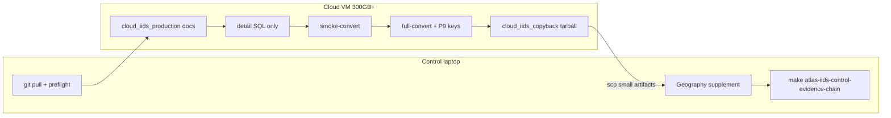

# Atlas IIDS Clean-Restart Runbook

**Checklist:** [ATLAS_IIDS_EXECUTION_CHECKLIST.md](ATLAS_IIDS_EXECUTION_CHECKLIST.md) — run `make atlas-iids-workflow` for live status.

## Situation

The previous partial OpenXLab/IIDS download has been deleted. There is no resumable cache to preserve.

This is now a clean restart. Do not attempt WSL recovery. Do not use WSL home as the target directory. Do not attempt the production run on a machine with roughly 38 GB free disk.

The goal is to produce real patent evidence for the Atlas without filling the Windows C: drive.

## Current known state

The repo is correctly gated:

```text
pcs_ready = true
atlas_software_ready = true
atlas_evidence_ready = false
atlas_phase1_ready = false
patent_source_status = missing_real_exports
n_raw_patent_records = 0
source_files = []
```

This is expected until real patent exports are produced.

## Repo / remote verification (2026-05-22)

`git push origin main` reports **Everything up-to-date**. Remote `main` is at **`1d5a1b3`** (safety scripts: WSL/C: blocks, `windows_iids_external.ps1`).

Fresh check on a control laptop:

| Check | Result |
|-------|--------|
| `Test-Path scripts\windows_iids_external.ps1` | True |
| `--detail-only` in script 59 | Present |
| `ForceWsl` in `wsl_start_iids_production.ps1` | Present |

Latest commits on `main`:

- `1d5a1b3` — Block WSL and C: IIDS downloads; add external SSD launcher script.
- `4132573` — Add clean restart IIDS runbook after deleted partial downloads.

If engineers do not see these on GitHub, run `git fetch origin` and confirm:

```text
git rev-parse origin/main
# 1d5a1b3ea699156160e9f7547dc8c3c22e448092
```

## Control laptop disk (C:)

| When | Free on C: |
|------|------------|
| Before temp cleanup | ~12.4 GB |
| After temp cleanup | ~29.8 GB |

Enough for `git pull`, Python, and repo work. **Do not** put the 136 GB SQL on C:. **No external SSD (D: or E:) is attached on the control laptop** — production download/convert runs on a **cloud VM** (Option B below).

## Correct next steps (no download on control laptop yet)

**On any engineer machine (control / repo):**

```powershell
cd <repo>
git pull
Test-Path scripts\windows_iids_external.ps1   # must be True
make atlas-iids-preflight
python scripts/50_atlas_status.py --json
```

**Production (136 GB SQL) — cloud VM only until an external SSD exists:**

1. Provision Ubuntu VM, **300 GB** disk, set rotated `OPENXLAB_AK` / `OPENXLAB_SK`.
2. `export OPENXLAB_IIDS_SOURCES_DIR=/mnt/iids_sources`
3. Run: `docs` → `detail` → `smoke-convert` → `full-convert` via `scripts/cloud_iids_production.sh`.
4. Copy back filtered CSV + manifest tables only (not the SQL).
5. On the control laptop: build `cnipa_patent_geography_2015_2024.csv`, then run the evidence chain.

**If an external SSD is attached later (D: or E:):**

```powershell
powershell -File scripts\windows_iids_external.ps1 -TargetDir D:\iids_sources -Step docs
# then detail, smoke-convert, full-convert
```

Do **not** run production on C:, WSL home, or WSL paths. Do **not** start procurement or paper claims until the evidence gate passes.

## End-to-end workflow (cloud-first)



| Stage | Command | Artifact |
|-------|---------|----------|
| VM status | `make atlas-iids-cloud STEP=status` | P8 / P8b tables |
| VM download | `STEP=docs` then `STEP=detail` | `base_patent_detail.sql` on VM only |
| VM convert | `STEP=smoke-convert` then `STEP=full-convert` | `data/raw/patents/opendatalab_iids_*.csv` |
| VM pack | `make atlas-iids-cloud-copyback` | `atlas_iids_filtered_outputs.tar.gz` |
| Laptop import | `make atlas-iids-import-copyback ARCHIVE=...` or `scripts/import_iids_copyback.ps1` | Extract + verify |
| Laptop verify | `make atlas-iids-verify-copyback` | `table_P8c_iids_copyback_verification.json` |
| Laptop geo brief | `make atlas-iids-geography-brief` | `docs/ATLAS_IIDS_GEOGRAPHY_PROCUREMENT_BRIEF.md` |
| Laptop gates | `make atlas-iids-control-evidence-chain` | `atlas_evidence_ready=true` |

Do not download all of IIDS.

Only the following large file is required for the patent layer:

```text
base_patent_detail.sql
```

Optional:

```text
base_patent_law_status.sql
```

Skip the following for this sprint:

```text
entity_fund_info.sql
entity_funds_re.zip
entity_paper.sql
reference_citation_re.sql
```

They are not required for the Atlas patent evidence layer.

---

# Recommended production setup

**If you have no external SSD (no D: or E: drive):** use **Option B — Cloud VM** only. The repo laptop (~30 GB free on C:) is for `git pull`, preflight, and the evidence chain after you copy back filtered CSVs — not for the 136 GB SQL download.

Use one of the following when storage is available:

## Option A — External SSD attached to Windows (optional)

Minimum:

```text
256 GB external SSD
```

Recommended:

```text
512 GB external SSD
```

Assume drive letter:

```text
D:
```

Use:

```text
D:\iids_sources
```

## Option B — Cloud VM

Recommended machine:

```text
Ubuntu VM
300 GB disk
8–16 vCPU
32 GB RAM preferred
```

Use:

```text
/mnt/iids_sources
```

Cloud is preferable if the Windows/OpenXLab/TLS path is unstable.

---

# Clean restart on external SSD

## Step 0 — Pull latest repo

```powershell
cd c:\Users\mateo\ai_diffusion_state
git pull
```

Confirm PCS and Atlas software state:

```powershell
make pcs-guard
make atlas-iids-preflight
python scripts/50_atlas_status.py --json
```

Expected:

```text
PCS passes.
Atlas software ready.
Atlas evidence not ready.
missing_real_exports.
```

## Step 1 — Prepare external target

```powershell
New-Item -ItemType Directory -Force D:\iids_sources
```

Set environment variables:

```powershell
$env:OPENXLAB_IIDS_SOURCES_DIR="D:\iids_sources"
$env:OPENXLAB_AK="YOUR_ROTATED_KEY"
$env:OPENXLAB_SK="YOUR_ROTATED_SECRET"
$env:OPENXLAB_INSECURE_SSL="1"
$env:PYTHONUTF8="1"
```

Use rotated OpenXLab credentials. Do not reuse exposed credentials. Do not commit credentials.

## Step 2 — Download docs only first

```powershell
python scripts/59_download_iids_patent_sources.py --target-dir D:\iids_sources
python scripts/60_inspect_iids_patent_schema.py
```

This should download only:

```text
README.md
metafile.yaml
Intelligent Innovation Dataset Technical Document.docx
智创数据库技术文档.docx
```

## Step 3 — Download only the patent-detail SQL

Preferred low-disk command if `--detail-only` exists in the current branch:

```powershell
python scripts/59_download_iids_patent_sources.py --detail-only --target-dir D:\iids_sources
```

If `--detail-only` does not exist yet, use the direct OpenXLab SDK snippet:

```powershell
python - <<'PY'
from pathlib import Path
import os
import openxlab
from openxlab.dataset import download

openxlab.login(ak=os.environ["OPENXLAB_AK"], sk=os.environ["OPENXLAB_SK"])
target = Path(r"D:\iids_sources")
target.mkdir(parents=True, exist_ok=True)

download(
    dataset_repo="Gracie/IIDS",
    source_path="/base_patent_detail.sql",
    target_path=str(target),
)
PY
```

Do not download the full IIDS repository. Do not download funding, papers, or citation files.

## Step 4 — Locate the completed SQL

```powershell
Get-ChildItem D:\iids_sources -Recurse -Filter base_patent_detail.sql
```

Expected final file path resembles:

```text
D:\iids_sources\Gracie___IIDS\base_patent_detail.sql\base_patent_detail.sql
```

If only `.odl` chunks exist, the download is incomplete.

## Step 5 — Smoke conversion

Run a small conversion before the full scan:

```powershell
python scripts/61_iids_sql_to_patent_csv.py `
  --detail-sql "D:\iids_sources\Gracie___IIDS\base_patent_detail.sql\base_patent_detail.sql" `
  --max-rows 50000
```

Then inspect:

```powershell
python scripts/58_prepare_patent_source_manifest.py
```

Check:

```text
outputs/tables/table_P0_patent_export_schema_diagnostics.csv
```

If the output schema is valid, proceed to full conversion.

## Step 6 — Full conversion

```powershell
python scripts/61_iids_sql_to_patent_csv.py `
  --detail-sql "D:\iids_sources\Gracie___IIDS\base_patent_detail.sql\base_patent_detail.sql"
```

Expected output:

```text
data/raw/patents/opendatalab_iids_industrial_ai_patents_2015_2024_part1.csv
```

After this output exists and has enough rows, the large SQL file can be archived or deleted. Keep the filtered CSV.

## Step 7 — Prepare manifest draft

```powershell
make atlas-patent-prep
```

Then inspect:

```text
data/raw/patents/patent_source_manifest_draft.csv
```

Fill all `FILL_ME` fields. Then merge:

```powershell
make atlas-iids-manifest-merge
```

The manifest may still fail if geography is missing. That is expected until the geography supplement is joined.

---

# Geography supplement is the next critical path

IIDS does not provide sufficient city/province/address fields. The Atlas requires city-industry-year evidence, so build a geography supplement only for the filtered IIDS patent IDs.

Target file:

```text
data/raw/patents/cnipa_patent_geography_2015_2024.csv
```

Required columns:

```text
patent_id
publication_number
applicant_name
applicant_city
applicant_province
applicant_address
geography_source
geography_source_url
city_mapping_confidence
notes
```

Minimum acceptance:

```text
city fill rate >= 80%
50+ cities
10+ industries after join
500+ retained industrial AI records after join
```

Strong acceptance:

```text
city fill rate >= 90%
100+ cities
20+ industries
5,000+ retained industrial AI records after join
```

## Recommended geography source

Use one of:

```text
CNIPA export with publication number + applicant address
Lens export with publication number + applicant address/city
CNKI/CNRDS/CSMAR patent metadata with address fields
```

Do not attempt to download a full patent-address universe. Export geography only for the filtered IIDS patent IDs if possible.

## Geography commands

After the geography export is placed in `data/raw/patents/`:

```powershell
make atlas-iids-geo-build
make atlas-iids-geo-validate
make atlas-iids-geo
```

If auto-discovery fails:

```powershell
python scripts/65_build_patent_geography_from_export.py --export data/raw/patents/YOUR_GEOGRAPHY_EXPORT.csv
python scripts/63_validate_patent_geography_supplement.py
python scripts/62_join_iids_patent_geography.py
```

---

# Full evidence chain

After IIDS conversion, geography join, and manifest completion:

```powershell
make atlas-evidence-check
make atlas-patents
make atlas-v02
make atlas-models-v02
python scripts/50_atlas_status.py --json
```

Final required state:

```text
fixture_patents_detected = false
real_patent_source_present = true
patent_layer_ready = true
atlas_evidence_ready = true
atlas_models_ready = true
atlas_phase1_ready = true
```

Only then can `paper/draft_atlas_v1.md` become an empirical paper draft.

---

# Cloud VM production (default when no D:/E: drive)

If there is no external SSD, use a cloud VM. Orchestration:

```bash
export OPENXLAB_AK="YOUR_ROTATED_KEY"
export OPENXLAB_SK="YOUR_ROTATED_SECRET"
export OPENXLAB_IIDS_SOURCES_DIR="/mnt/iids_sources"
export OPENXLAB_INSECURE_SSL=1
export PYTHONUTF8=1

bash scripts/cloud_iids_production.sh status
bash scripts/cloud_iids_production.sh docs
bash scripts/cloud_iids_production.sh detail
bash scripts/cloud_iids_production.sh smoke-convert
bash scripts/cloud_iids_production.sh full-convert
```

## Setup

```bash
git clone https://github.com/fraware/ai_diffusion_state.git
cd ai_diffusion_state
python -m venv .venv
source .venv/bin/activate
pip install -U pip
pip install -e .[dev] || pip install pandas openpyxl statsmodels requests beautifulsoup4 openxlab
```

## Run (manual alternative)

If you prefer raw commands instead of `cloud_iids_production.sh`:

```bash
export OPENXLAB_AK="YOUR_ROTATED_KEY"
export OPENXLAB_SK="YOUR_ROTATED_SECRET"
export OPENXLAB_IIDS_SOURCES_DIR="/mnt/iids_sources"
export PYTHONUTF8=1

python scripts/59_download_iids_patent_sources.py --detail-only --target-dir /mnt/iids_sources
find /mnt/iids_sources -name base_patent_detail.sql
python scripts/61_iids_sql_to_patent_csv.py --detail-sql /mnt/iids_sources/Gracie___IIDS/base_patent_detail.sql/base_patent_detail.sql --production
python scripts/58_prepare_patent_source_manifest.py
```

Copy back only:

```text
data/raw/patents/opendatalab_iids_industrial_ai_patents_2015_2024_part1.csv
data/raw/patents/patent_source_manifest_draft.csv
outputs/tables/table_P0_patent_export_schema_diagnostics.csv
```

Do not copy back the large SQL dump.

---

# Forbidden actions

Do not:

```text
continue in WSL home
attempt full SQL download with 38 GB free
weaken atlas_evidence_ready
start procurement
rewrite draft_atlas_v1.md as empirical
use smoke/fixture outputs as evidence
commit OpenXLab credentials
commit proprietary raw SQL if license forbids it
```

## Bottom line

The deleted partial download is not a problem. Restart clean on a **cloud VM** (or external SSD when available), download only `base_patent_detail.sql`, convert once, discard/archive the SQL on the production host, and build geography only for the filtered IIDS patent IDs.
