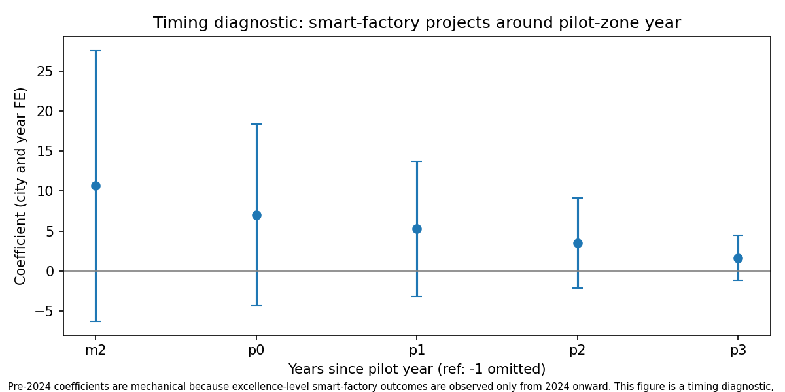

# The Diffusion State: AI Pilot Zones, Smart Factories, and the Hub Architecture of China’s Industrial AI Adoption

**Draft v1**  
**Status:** Research draft grounded in `paper/main_tables/`, `paper/results_memo.md`, `paper/red_team_memo.md`, `paper/reviewer_results_snapshot.md`, and `paper/claim_table_map.csv`.  
**Core thesis:** China’s AI diffusion state is visible as a hub-centered industrial adoption architecture. Pilot-zone designation marks part of this architecture, but the evidence does not establish a uniform average treatment effect across treated cities.

## Abstract

Most comparisons of artificial intelligence in China and the United States focus on frontier models, private investment, compute, and leading laboratories. This paper studies a different unit of economic analysis: the institutional architecture through which AI capabilities are translated into industrial adoption. I develop the concept of the AI diffusion state to describe a system in which national policy designations, municipal capacity, manufacturing ecosystems, smart-factory recognition, and sectoral upgrading operate as a connected adoption infrastructure. The empirical setting is China’s National New Generation AI Innovation and Development Pilot Zones and the Ministry of Industry and Information Technology’s 2024 and 2025 excellence-level smart-factory lists.

The paper constructs a reproducible dataset linking 17 AI pilot-zone units and 509 MIIT excellence-level smart-factory projects. All 509 projects are assigned to cities, with location assignments classified into official-location exact rows, rule-based city inferences, and externally verified rows. A stratified audit evaluates city-resolution quality, and 50 project-city assignments are supported by non-list external evidence. The resulting measurement framework shows that listed smart-factory recognition is highly concentrated in pilot-zone and high-capacity hub cities. Pilot-zone cities account for 192 listed projects across 16 cities, with a mean of 12.00 projects per city, compared with 317 projects across 143 non-pilot cities, with a mean of 2.22 projects per city.

Hub-exclusion results qualify the interpretation. The baseline pilot-zone association remains positive and statistically significant, but it attenuates when major hubs and direct-admin municipalities are removed. Dropping Beijing, Shanghai, Shenzhen, and Hangzhou reduces the pilot-zone coefficient from 4.55 to 3.67. Dropping direct-admin municipalities reduces it to 2.90, and dropping the top five smart-factory cities reduces it to 2.95. These patterns support a hub-centered diffusion interpretation. Pilot-zone designation marks part of China’s industrial AI adoption architecture, yet the evidence does not identify a causal treatment effect of designation itself. As appendix robustness, a partial public-controls specification using China City Statistical Yearbook tables obtained through ChinaUTC shows that the pilot-zone association remains positive in OLS count and log-count models in a limited 2024 cross-section, while the Poisson specification is not statistically significant. The paper contributes a measurement architecture for AI diffusion and a more precise account of how China’s industrial AI strategy appears in city, sector, and institutional space.

## 1. Introduction

The global AI competition is often described through the language of frontier capability. The standard comparison asks which country produces the most capable models, attracts the largest private investment, controls the most advanced compute, and houses the strongest laboratories. Those metrics matter, yet they capture only one part of the economic transformation produced by artificial intelligence. AI becomes economically significant when capability diffuses into production, logistics, administration, engineering, and industrial coordination. A model frontier can move quickly while the adoption frontier moves slowly. A state can lag in one dimension of capability and still build a powerful advantage in the machinery of diffusion.

This paper studies that second frontier. It asks whether China’s AI strategy can be understood as a diffusion-state project, where the relevant economic object is neither the frontier model alone nor the individual firm alone, but the institutional system linking national designations, local governments, manufacturing ecosystems, smart-factory recognition, industrial software, and export-relevant sectors. The central claim is empirical and conceptual. China’s AI diffusion state is visible as a hub-centered industrial adoption architecture. Pilot-zone designation marks part of this architecture, but the evidence does not establish a uniform average treatment effect across treated cities.

The empirical setting combines two policy and industrial layers. The first is China’s National New Generation AI Innovation and Development Pilot Zones, coded here as 17 city or county-level units designated between 2019 and 2021. The second is the Ministry of Industry and Information Technology’s excellence-level smart-factory recognition system, observed through the 2024 and 2025 public lists. The project constructs a reproducible city-level and city-industry-level measurement pipeline that links these two layers. The resulting dataset includes 509 listed smart-factory projects, all assigned to cities through an evidence-classified location procedure.

The data reveal a strong descriptive concentration. Pilot-zone cities account for 192 listed smart-factory projects across 16 cities, while non-pilot cities account for 317 projects across 143 cities. The mean listed project count is 12.00 per pilot-zone city and 2.22 per non-pilot city. The baseline pilot-zone coefficient in city-year adoption models is 4.55, with p < 0.001. These facts show that the pilot-zone map and the smart-factory recognition map overlap substantially.

The more important result comes from asking where the association weakens. When Beijing, Shanghai, Shenzhen, and Hangzhou are removed, the pilot-zone coefficient falls to 3.67. When direct-admin municipalities are removed, it falls to 2.90. When the top five smart-factory cities are removed, it falls to 2.95. These estimates remain positive and statistically significant, yet the attenuation is economically meaningful. The pattern suggests that pilot-zone status is entangled with municipal capacity, direct-admin administrative power, and industrial hub structure. China’s diffusion state appears less like a flat policy treatment and more like a hub-and-spoke architecture.

This distinction matters for the economics of AI. If the main policy question is framed as frontier-model leadership, the analysis naturally focuses on labs, foundation-model benchmarks, private investment, chips, and compute controls. If the question is framed as industrial diffusion, the analysis shifts toward adoption institutions, public recognition systems, local implementation capacity, city-level industrial structure, and sectoral complementarities. The economic consequences of AI may depend as much on this diffusion layer as on the model frontier itself.

The contribution of this paper is therefore threefold. First, it introduces an operational measurement framework for China’s industrial AI diffusion by linking AI pilot zones and smart-factory recognition. Second, it distinguishes pilot-zone overlap from hub-centered diffusion architecture, using hub-exclusion and typology evidence to qualify the interpretation. Third, it connects the geography of adoption to sectoral and export relevance while keeping causal claims appropriately limited. The paper does not estimate a causal average treatment effect of pilot-zone designation. It measures an adoption architecture and shows that the architecture is spatially concentrated.

## 2. Institutional background

China’s AI policy combines national planning, local experimentation, industrial upgrading, and administrative recognition. The National New Generation AI Innovation and Development Pilot Zones are one layer of this system. They designate cities and localities as experimental and implementation environments for AI development and application. These zones are not randomly assigned. They are chosen from places with existing research capacity, industrial depth, platform firms, local administrative capability, or strategic industrial relevance. Treating them as a clean policy shock would overstate what the data can support. Treating them as markers of a broader institutional architecture is more appropriate.

The smart-factory recognition system is another layer. MIIT’s excellence-level smart-factory lists identify projects that exemplify advanced smart-manufacturing adoption. These lists do not measure the complete stock of Chinese smart factories. They measure official recognition of particular projects. That limitation is important, but it also makes the lists analytically useful. Official recognition is itself part of the diffusion system. It signals standards, showcases implementation models, and links firm-level adoption to administrative and industrial-policy frameworks.

Together, AI pilot zones and smart-factory recognition provide a window into the industrialization of AI. Pilot zones mark places selected for AI development and application capacity. Smart-factory projects mark recognized adoption in production environments. The overlap between the two is not a causal design by itself, but it is an observable signature of diffusion-state architecture.

This paper uses that overlap carefully. It does not claim that pilot-zone designation caused firms to build smart factories. It asks whether listed smart-factory adoption is concentrated in the same geography as AI pilot-zone status and whether that concentration is better interpreted as a binary pilot effect or as a hub-centered architecture. The answer is the second. Pilot status matters descriptively, yet hub structure is central.

## 2.1 Related literature

This paper connects four literatures without claiming to close any of them empirically. First, the economics of general-purpose technologies emphasizes implementation lags: capability can advance faster than measurable productivity because adoption requires organizational and infrastructural complements [@brynjolfsson2021productivity; @bloom2020diffusion]. Second, automation and task-based frameworks highlight how robotics, vision systems, and process software reshape production rather than uniformly displacing labor [@acemoglu2014robots; @ifr2023worldrobotics]. Third, the China-shock and industrial-policy literatures show that Chinese manufacturing upgrading is spatially concentrated and institutionally mediated rather than evenly distributed across cities [@autor2013china]. Fourth, the global AI debate—often framed through frontier models and national capability rankings—understates the industrial adoption layer that policy lists, recognition systems, and city-level implementation make visible [@masi2024aiindex].

The contribution here is measurement architecture. The paper does not estimate a causal treatment effect of pilot-zone designation. It operationalizes a diffusion-state object: national AI pilot zones, MIIT excellence-level smart-factory recognition, evidence-classified city assignment, hub typologies, ex ante industry exposure, and export-relevant sector descriptives. That design follows the evidentiary hierarchy in `paper/claim_table_map.csv` and keeps appendix controls (Table I; [@chinautc2024]) separate from strict EPS/NBS specifications.

## 3. Data and measurement

The empirical pipeline links four layers: AI pilot zones, MIIT excellence-level smart-factory projects, city-resolution evidence, and sectoral/export relevance. All paper-facing claims are mapped to reproducible artifacts in the repository. The claim table distinguishes measured facts, validated descriptive claims, baseline associations, coarse robustness checks, suggestive mechanisms, blocked controlled specifications, and unsupported causal claims.

The pilot-zone table contains 17 AI pilot-zone units designated between 2019 and 2021 [@cset2020pilotzones; @xinhua2021seventeenzones]. The smart-factory project table contains 509 MIIT excellence-level projects, with 235 projects from the 2024 list and 274 projects from the 2025 list [@miit2024smartfactory; @miit2025smartfactory]. These projects form the main adoption measure. The unit is official listed recognition, not all smart-factory activity in China.

City assignment is a major measurement task. The smart-factory lists and reposts do not always provide clean project-level city addresses. The pipeline assigns all 509 projects to cities and classifies each assignment by evidence quality. In the current build, 102 projects are `official_location_exact`, 357 are `rule_based_text_inference`, and 50 are `external_evidence_verified`. The external class requires non-list evidence, such as company sites, annual reports, local-government documents, industrial-park pages, or registry records. The distinction matters because rule-based geocoding and external verification have different evidentiary strength.

A stratified audit evaluates the city-resolution procedure. The audit covers 70 rows, including 20 official-location rows and 50 rule-based rows. The official-location sample is fully confirmed, with 20 out of 20 confirmed. The rule-based sample has 20 confirmed rows and 30 rows marked insufficient evidence. There are no incorrect rows in the audit sample. This result supports the reliability of official-location assignments and identifies the weaker status of some rule-based inferences. It does not turn the entire register into externally audited geocoding. The paper therefore reports evidence classes and audit results separately.

The resulting city-level dataset covers 159 resolved cities with listed projects and a 160-city adoption panel including pilot and smart-factory universe cities. Pre-2024 years in the panel are zero-filled for smart-factory counts because the public excellence-level lists begin in 2024. Event-time figures therefore serve only as timing diagnostics, not as pre-trend validation.

The dataset also links smart-factory projects to industry classifications and ex ante AI-exposure categories. The preferred industry heterogeneity specification uses ex ante technological compatibility with industrial AI. Tag-derived exposure based on observed project descriptions is treated as descriptive only. This distinction prevents the outcome measure from defining the exposure measure.

Finally, the export relevance tables connect smart-factory sectors to China’s export basket. These tables are descriptive. They show whether smart-factory recognition is concentrated in sectors relevant to China’s advanced manufacturing export structure. They do not estimate causal export effects.

## 4. Descriptive overlap between pilot zones and smart factories

The first empirical result is a large descriptive overlap between AI pilot-zone geography and smart-factory recognition. Among resolved cities, pilot-zone cities account for 192 listed smart-factory projects across 16 cities. Non-pilot cities account for 317 projects across 143 cities. The mean count is 12.00 projects per pilot-zone city and 2.22 projects per non-pilot city. The difference is 9.78 projects per city.

This fact establishes the starting point. Listed smart-factory recognition is not evenly distributed across the city system. It is concentrated in places that also appear in the AI pilot-zone map. The top listed cities further show the importance of major hubs. Shanghai has 30 projects and is a pilot city. Chongqing has 22 and is a pilot city. Beijing has 19 and is a pilot city. Tianjin has 17 and is a pilot city. Qingdao has 14 and is a non-pilot city. The geography is concentrated, but the concentration is not exhausted by the pilot binary.

Baseline adoption models support the same descriptive pattern. In the city-year adoption panel, the pilot-zone coefficient is 4.55 with p < 0.001. The sample contains 320 city-years and 160 cities. This coefficient should be interpreted with care. It is an association between pilot-zone status and listed project counts in a constructed adoption universe. It is not a causal estimate of policy designation. The pilot-zone variable is correlated with pre-existing city capacity, industrial structure, administrative status, and innovation ecosystems.

The overlap nevertheless matters. It suggests that China’s AI industrialization model has a spatial structure. AI policy designation and smart-manufacturing recognition are aligned in a specific set of cities. The next empirical question is whether that alignment reflects a simple pilot-zone contrast or a more concentrated hub architecture.

## 5. Hub architecture and attenuation

Hub-exclusion robustness is the central empirical device in the paper. It asks what happens to the pilot-zone association when the most prominent hubs are removed. The goal is not to eliminate all selection bias. The goal is to distinguish a flat pilot-zone interpretation from a hub-centered interpretation.

In the full analysis universe, the pilot-zone coefficient is 4.55, with p < 0.001. When Beijing, Shanghai, Shenzhen, and Hangzhou are removed, the coefficient falls to 3.67. This is approximately 81 percent of the full-sample coefficient. When Guangzhou is also removed, the coefficient is 3.73, approximately 82 percent of the full-sample coefficient. When all direct-admin municipalities are removed, the coefficient falls to 2.90, approximately 64 percent of the full-sample coefficient. When the top five smart-factory cities are removed, it falls to 2.95, approximately 65 percent of the full-sample coefficient. The coefficient remains positive and statistically significant in these exclusions, but the attenuation is substantial.

This pattern is the main evidence for the hub-centered interpretation. A flat pilot-zone story would imply that the association is broadly similar across treated cities. A pure mega-city story would imply that the association disappears once the largest hubs are removed. The results sit between those extremes. Pilot-zone cities retain a positive association, yet a large share of the baseline relationship is mediated by high-capacity cities, direct-admin municipalities, and major industrial hubs.

The city typology tables provide the descriptive counterpart to the exclusions. Cities are classified into frontier municipality hubs, pilot industrial hubs, pilot non-hubs, non-pilot industrial hubs, and non-pilot low-adoption cities. This typology better matches the observed geography than the pilot/non-pilot binary alone. Diffusion is clustered by institutional and industrial capacity. Pilot zones are one layer of that clustering, while direct administrative status, industrial depth, and manufacturing ecosystems form another.

The ex ante city typology is important because it avoids defining hub status entirely from smart-factory outcomes. It uses pre-existing city attributes such as pilot designation, direct-admin status, and mega-hub flags. Where real controls are unavailable, the typology avoids GDP-based capacity labels unless the source is valid. This preserves the distinction between descriptive outcome clusters and ex ante capacity categories.

The interpretation is therefore precise. China’s AI diffusion state appears as a hub-and-spoke adoption system. National designation is meaningful, but it operates through places with administrative power, industrial assets, and the capacity to absorb and showcase AI-enabled manufacturing. The pilot-zone map is part of the architecture. It is not a clean treatment assignment.

## 6. Industry heterogeneity and industrial AI exposure

The diffusion-state concept also has a sectoral dimension. AI adoption in manufacturing is not equally useful across all activities. Industrial AI is especially relevant where production involves machine vision, quality inspection, predictive maintenance, digital twins, intelligent scheduling, industrial robotics, smart logistics, semiconductor manufacturing, battery production, automotive production, industrial machinery, chemicals, pharmaceuticals, and other process-intensive sectors.

The paper therefore uses ex ante industry AI exposure to study whether listed adoption is concentrated in sectors where AI is technologically complementary to production. The preferred city-industry specifications rely on ex ante exposure classifications rather than tags derived from the project descriptions. This reduces the risk of building the exposure variable from the outcome itself.

The industry results should be interpreted as suggestive mechanism evidence. They are not a standalone causal design. They help explain why the diffusion state might operate through particular cities and sectors. High-capacity cities matter because they host industries where AI-enabled production systems can be absorbed, demonstrated, and scaled. The hub architecture is therefore not only geographic. It is also industrial.

This sectoral view sharpens the paper’s theoretical contribution. AI diffusion is not simply the spread of software across firms. In industrial settings, diffusion depends on compatibility between AI capabilities and production systems. Cities with dense manufacturing ecosystems, skilled engineering labor, industrial parks, local implementation capacity, and existing automation infrastructure may be better positioned to turn AI capability into recognized smart-factory adoption.

## 7. Export relevance

The export tables provide a descriptive link between smart-factory recognition and China’s advanced manufacturing position. The paper does not claim that smart-factory recognition caused export upgrading. It asks whether the sectors represented in the smart-factory lists are strategically relevant to China’s export basket.

This distinction is essential. Export growth depends on many factors, including global demand, exchange rates, trade policy, supply chains, firm competitiveness, and industrial composition. The current design does not isolate the causal effect of listed smart-factory recognition on export performance. The export analysis should therefore be read as strategic relevance, not as an effect estimate.

The relevance claim is still useful. If smart-factory recognition is concentrated in sectors such as electronics, batteries, machinery, automotive components, steel, chemicals, pharmaceuticals, shipbuilding, and AI servers, then the diffusion architecture is connected to tradable industrial capacity. That connection helps explain why AI adoption is an economic and geopolitical issue. The diffusion state is not only about domestic modernization. It is also about competitiveness in sectors that matter for global manufacturing.

The paper’s export section should therefore remain descriptive. It establishes that the industrial AI adoption layer overlaps with sectors of strategic export importance. It does not estimate productivity gains or export effects.

## 8. Appendix robustness: partial public controls

Strict EPS/NBS controlled models remain unavailable because the public ChinaUTC bundle lacks FDI and fixed-asset investment. The paper therefore reports a separate appendix robustness specification using partial public China City Statistical Yearbook controls. This specification is not equivalent to the intended EPS/NBS production-control design.

The appendix model uses a 2024 ChinaUTC public-control subset with 51 complete city observations. Controls include GDP, population, secondary-industry structure, foreign trade, telecom, and industrial-output proxies. In this limited cross-section, pilot-zone status remains positively associated with listed smart-factory counts in OLS count and log-count specifications. The OLS count coefficient is +1.58 with p = 0.020. The OLS log-count coefficient is +0.50 with p = 0.018. The Poisson count coefficient is +0.23 with p = 0.43.

This pattern is consistent with the main interpretation, but it should not be promoted to the central controlled result. The OLS estimates suggest that the pilot-zone association is not entirely explained by GDP, population, industrial structure, foreign trade, telecom, and industrial-output proxies in the limited public-control sample. The non-significant Poisson estimate, the small sample, the single-year design, and the missing FDI and fixed-asset investment variables all limit the result.

The appropriate paper language is narrow. As appendix robustness, the pilot-zone association remains positive in a limited 2024 public-controls cross-section. The result is significant in OLS count and log-count models, while the Poisson specification is not statistically significant. This is not evidence that strict EPS/NBS controlled models pass, and it is not evidence of a causal treatment effect.

## 9. What the paper does not claim

The paper makes several deliberate non-claims. It does not claim that pilot zones caused smart-factory adoption. It does not estimate an average treatment effect across treated cities. It does not claim that AI diffusion caused productivity growth. It does not claim that smart-factory recognition caused export upgrading. It does not treat MIIT excellence-level recognition as the complete universe of Chinese smart factories. It does not treat rule-based geocoding as external verification.

These limits are not weaknesses to hide. They define the contribution. The paper offers a measurement architecture for observing industrial AI diffusion in China. It shows that listed adoption is concentrated in pilot-zone and high-capacity hub cities. It documents that the pilot-zone association attenuates when key hubs are removed. It classifies city-resolution evidence and audits a stratified sample. It connects the adoption geography to ex ante industry exposure and export relevance. Those contributions are credible without causal overreach.

A stronger causal paper would require a different design. It would need either a credible quasi-experimental source of pilot-zone variation, richer pre-treatment city controls, firm-level adoption timing, or a policy discontinuity that separates designation from underlying capacity. The present paper takes a different path. It treats AI diffusion as a measurable institutional architecture and studies its geography.

## 10. Conclusion

The AI-China debate often begins with the frontier model. That starting point misses an important economic layer. AI capability becomes industrial power only when it diffuses into production systems, logistics, engineering workflows, quality control, and firm-level operations. China’s AI strategy should therefore be studied not only as a race for model capability, but also as a diffusion-state project.

This paper builds a reproducible measurement pipeline for that project. It links national AI pilot zones, MIIT excellence-level smart-factory recognition, city-resolution evidence classes, hub typologies, ex ante industry exposure, and export relevance. The evidence shows that listed smart-factory adoption is concentrated in pilot-zone and high-capacity hub cities. Pilot-zone cities have far more listed projects per city than non-pilot cities. Yet the association weakens when major hubs and direct-admin municipalities are removed, which points toward a hub-centered architecture rather than a uniform treatment effect.

The result is a more precise account of China’s AI industrialization model. The diffusion state does not appear as an evenly distributed national program. It appears as a spatially concentrated architecture built around administrative capacity, municipal scale, industrial ecosystems, and strategically relevant sectors. Pilot zones are visible markers of that architecture. They are not, in the current evidence, isolated causal instruments.

The policy implication is straightforward. Countries competing in AI should measure more than frontier capability. They should measure diffusion capacity: the institutions, cities, sectors, procurement systems, industrial parks, firms, and standards that convert AI capability into production. The next productivity shock may depend less on which political economy produces the single most capable model and more on which political economy can embed increasingly capable models into the industrial base fastest.

## Tables (paper/main_tables)

Embedded from reproducible CSVs. Claim tiers follow `paper/main_table_claim_map.csv`. Table I is appendix-only and not EPS-equivalent.

### Main text tables

### Table A

*Dataset counts and coverage (pilot zones, smart-factory projects, geo evidence classes).*

**Claim tier:** `measured` | **Claim ID:** `measurement_pilot_zones` | **Placement:** main

| dataset                                   | unit          |   observations | years_covered                | source                                         |
|:------------------------------------------|:--------------|---------------:|:-----------------------------|:-----------------------------------------------|
| pilot_zones                               | city/county   |             17 | 2019-2021                    | data/processed/pilot_zones.csv                 |
| smart_factories_clean                     | project       |            509 | 2024, 2025                   | data/processed/smart_factories_clean.csv       |
| smart_factory_city_year                   | city-year     |            224 | 2024, 2025 (resolved cities) | data/processed/smart_factory_city_year.csv     |
| smart_factory_province_year               | province-year |             59 | 2024, 2025                   | data/processed/smart_factory_province_year.csv |
| smart_factories_city_unknown              | project       |              0 | 2024, 2025                   | province-only location in MIIT tables          |
| smart_factories_city_resolved             | project       |            509 | 2024, 2025                   | parser + audited geo overrides                 |
| geo_resolution_rule_based_text_inference  | project       |            357 | 2024, 2025                   | data/processed/city_resolution_register.csv    |
| geo_resolution_official_location_exact    | project       |            102 | 2024, 2025                   | data/processed/city_resolution_register.csv    |
| geo_resolution_external_evidence_verified | project       |             50 | 2024, 2025                   | data/processed/city_resolution_register.csv    |

Source: `paper/main_tables/table_A_dataset_counts.csv` (9 rows in repository).

### Table B

*City-resolution evidence quality by resolution class and evidence type.*

**Claim tier:** `validated_descriptive` | **Claim ID:** `geo_resolution_quality` | **Placement:** main

| resolution_class           |   n_projects | evidence_type            |   share_projects |   n_with_source_list_url_only |   n_with_external_url |
|:---------------------------|-------------:|:-------------------------|-----------------:|------------------------------:|----------------------:|
| external_evidence_verified |           50 | _all                     |       0.0982318  |                             0 |                    50 |
| official_location_exact    |          102 | _all                     |       0.200393   |                           102 |                     0 |
| rule_based_text_inference  |          357 | _all                     |       0.701375   |                           357 |                     0 |
| external_evidence_verified |           11 | company_annual_report    |       0.021611   |                             0 |                    11 |
| external_evidence_verified |           23 | company_site_registry    |       0.0451866  |                             0 |                    23 |
| external_evidence_verified |            1 | industrial_park_page     |       0.00196464 |                             0 |                     1 |
| external_evidence_verified |           15 | project_registry         |       0.0294695  |                             0 |                    15 |
| official_location_exact    |          102 | miit_location_field      |       0.200393   |                           102 |                     0 |
| rule_based_text_inference  |           28 | embedded_html_table      |       0.0550098  |                            28 |                     0 |
| rule_based_text_inference  |           64 | firm_embedded_city_token |       0.125737   |                            64 |                     0 |
| rule_based_text_inference  |           22 | firm_parenthetical       |       0.043222   |                            22 |                     0 |
| rule_based_text_inference  |            1 | firm_province_county     |       0.00196464 |                             1 |                     0 |
| rule_based_text_inference  |          221 | firm_registry_match      |       0.434185   |                           221 |                     0 |
| rule_based_text_inference  |           17 | html_p_tag_rtl_location  |       0.0333988  |                            17 |                     0 |
| rule_based_text_inference  |            4 | project_branch_city      |       0.00785855 |                             4 |                     0 |

Source: `paper/main_tables/table_B_city_resolution_quality.csv` (15 rows in repository).

### Table C

*Pilot-zone vs non-pilot overlap in listed smart-factory projects (resolved cities).*

**Claim tier:** `validated_descriptive` | **Claim ID:** `descriptive_pilot_overlap` | **Placement:** main

| sample                |   n_cities |   total_projects_2024_2025 |   mean_projects_per_city |   median_projects_per_city |   mean_difference_pilot_minus_non |
|:----------------------|-----------:|---------------------------:|-------------------------:|---------------------------:|----------------------------------:|
| pilot_zone_cities     |         16 |                        192 |                 12       |                         11 |                           9.78322 |
| non_pilot_zone_cities |        143 |                        317 |                  2.21678 |                          1 |                           9.78322 |
| all_resolved_cities   |        159 |                        509 |                  3.20126 |                          2 |                           9.78322 |

Source: `paper/main_tables/table_C_pilot_overlap.csv` (3 rows in repository).

### Table D

*Hub-exclusion robustness for pilot-zone association in city-year adoption models.*

**Claim tier:** `robust_association` | **Claim ID:** `hub_robustness` | **Placement:** main

| exclusion_rule                                    | spec     |   n_cities |   n_projects | model          | term       |    coef |   std_err |     p_value | formula                                       | interpretation                                                              |   coefficient_relative_to_full_sample |   projects_remaining_share |
|:--------------------------------------------------|:---------|-----------:|-------------:|:---------------|:-----------|--------:|----------:|------------:|:----------------------------------------------|:----------------------------------------------------------------------------|--------------------------------------:|---------------------------:|
| full_sample                                       | baseline |        160 |          507 | baseline_count | pilot_zone | 4.54566 |  0.877318 | 2.20328e-07 | smart_factory_projects ~ pilot_zone + C(year) | baseline association (all resolved cities)                                  |                              1        |                   1        |
| drop_beijing_shanghai_shenzhen_hangzhou           | baseline |        156 |          439 | baseline_count | pilot_zone | 3.66783 |  0.768116 | 1.79614e-06 | smart_factory_projects ~ pilot_zone + C(year) | association weakens after dropping four mega-hubs                           |                              0.806887 |                   0.865878 |
| drop_beijing_shanghai_shenzhen_hangzhou_guangzhou | baseline |        155 |          431 | baseline_count | pilot_zone | 3.73193 |  0.828425 | 6.64182e-06 | smart_factory_projects ~ pilot_zone + C(year) | association weakens after dropping five mega-hubs                           |                              0.820988 |                   0.850099 |
| drop_direct_admin_municipalities                  | baseline |        156 |          419 | baseline_count | pilot_zone | 2.8986  |  0.514284 | 1.73851e-08 | smart_factory_projects ~ pilot_zone + C(year) | association weakens substantially when direct-admin municipalities excluded |                              0.637663 |                   0.82643  |
| drop_top_5_smart_factory_cities                   | baseline |        155 |          402 | baseline_count | pilot_zone | 2.9507  |  0.51174  | 8.11654e-09 | smart_factory_projects ~ pilot_zone + C(year) | association weakens when top adoption cities excluded                       |                              0.649126 |                   0.792899 |
| drop_top_10_gdp_cities                            | baseline |        150 |          408 | baseline_count | pilot_zone | 5.15435 |  1.29321  | 6.72836e-05 | smart_factory_projects ~ pilot_zone + C(year) | association under top-GDP-city exclusion (requires GDP controls)            |                              1.13391  |                   0.804734 |

Source: `paper/main_tables/table_D_hub_exclusion.csv` (6 rows in repository).

### Table E

*City diffusion typology — project counts by type (outcome-informed labels; descriptive).*

**Claim tier:** `validated_descriptive` | **Claim ID:** `hub_architecture_typology` | **Placement:** main

*Note: Aggregated from city-level typology file.*

| diffusion_type            |   resolved_smart_factory_projects |
|:--------------------------|----------------------------------:|
| nonpilot_low_adoption     |                               277 |
| frontier_municipality_hub |                                88 |
| pilot_non_hub             |                                77 |
| nonpilot_industrial_hub   |                                40 |
| pilot_industrial_hub      |                                27 |

Source: `paper/main_tables/table_E_city_typology.csv` (160 rows in repository).

### Table E (ex ante)

*Ex ante city capacity typology — project counts by type (pre-outcome labels).*

**Claim tier:** `validated_descriptive` | **Claim ID:** `hub_architecture_typology_ex_ante` | **Placement:** main

*Note: City counts by ex ante typology (not project-weighted).*

| diffusion_type_ex_ante        |   n_cities |
|:------------------------------|-----------:|
| ex_ante_nonpilot_low_capacity |        143 |
| ex_ante_pilot_non_hub         |         10 |
| frontier_municipality_hub     |          4 |
| ex_ante_pilot_hub             |          3 |

Source: `paper/main_tables/table_E_ex_ante_city_typology.csv` (160 rows in repository).

### Table F

*City-industry adoption models — key terms only (ex ante exposure interactions).*

**Claim tier:** `suggestive_mechanism` | **Claim ID:** `city_industry_exposure_ex_ante` | **Placement:** main

*Note: FE coefficients omitted; tag-derived spec is descriptive-only (not for main causal claims).*

| model                                          | term                             |       coef |   std_err |     p_value |   n_obs | exposure_source         |
|:-----------------------------------------------|:---------------------------------|-----------:|----------:|------------:|--------:|:------------------------|
| city_industry_pilot_x_exposure_ex_ante         | Intercept                        |  0.831825  | 0.126274  | 4.47481e-11 |     385 | ex_ante                 |
| city_industry_pilot_x_exposure_ex_ante         | pilot_zone                       | -0.166057  | 0.0988302 | 0.0929129   |     385 | ex_ante                 |
| city_industry_pilot_x_exposure_ex_ante         | high_exposure_ex_ante            | -0.0626271 | 0.0800926 | 0.434253    |     385 | ex_ante                 |
| city_industry_pilot_x_exposure_ex_ante         | pilot_zone:high_exposure_ex_ante |  0.262465  | 0.0786456 | 0.000845941 |     385 | ex_ante                 |
| city_industry_pilot_x_score_ex_ante            | Intercept                        |  0.780737  | 0.130601  | 2.25858e-09 |     385 | ex_ante                 |
| city_industry_pilot_x_score_ex_ante            | pilot_zone                       | -0.206648  | 0.109021  | 0.0580291   |     385 | ex_ante                 |
| city_industry_pilot_x_score_ex_ante            | ai_exposure_ex_ante              |  0.0129569 | 0.0405087 | 0.749078    |     385 | ex_ante                 |
| city_industry_pilot_x_score_ex_ante            | pilot_zone:ai_exposure_ex_ante   |  0.158893  | 0.0543758 | 0.00347641  |     385 | ex_ante                 |
| city_industry_pilot_x_exposure_tag_descriptive | Intercept                        |  0.831825  | 0.126274  | 4.47481e-11 |     385 | descriptive_tag_derived |
| city_industry_pilot_x_exposure_tag_descriptive | pilot_zone                       | -0.166057  | 0.0988302 | 0.0929129   |     385 | descriptive_tag_derived |
| city_industry_pilot_x_exposure_tag_descriptive | high_exposure_sector             | -0.0626271 | 0.0800926 | 0.434253    |     385 | descriptive_tag_derived |
| city_industry_pilot_x_exposure_tag_descriptive | pilot_zone:high_exposure_sector  |  0.262465  | 0.0786456 | 0.000845941 |     385 | descriptive_tag_derived |

Source: `paper/main_tables/table_F_ex_ante_industry_heterogeneity.csv` (903 rows in repository).

### Table G

*Export relevance of smart-factory sectors (descriptive).*

**Claim tier:** `validated_descriptive` | **Claim ID:** `export_relevance_descriptive` | **Placement:** main

| sector_group                       |   smart_factory_projects |   share_of_smart_factory_projects |   export_value_2024_x |   share_of_china_exports_2024 |   export_value_2017 |   export_value_2024_y |   log_export_growth_2017_2024 |   unit_value_index_2017 |   unit_value_index_2024 |   log_unit_value_growth_2017_2024 | growth_method       | mapping_confidence   | note                                                         |
|:-----------------------------------|-------------------------:|----------------------------------:|----------------------:|------------------------------:|--------------------:|----------------------:|------------------------------:|------------------------:|------------------------:|----------------------------------:|:--------------------|:---------------------|:-------------------------------------------------------------|
| ai_servers_and_computing_equipment |                       48 |                        0.0943026  |           1.24944e+12 |                    0.452604   |         8.80569e+11 |           1.24944e+12 |                      0.349883 |                       1 |                 1.30499 |                          0.266198 | log_level_2017_2024 | high                 | Descriptive strategic relevance; not a causal export effect. |
| autos_and_nev                      |                       37 |                        0.0726916  |           2.10354e+11 |                    0.0761999  |         6.7956e+10  |           2.10354e+11 |                      1.12993  |                       1 |                 3.09545 |                          1.12993  | log_level_2017_2024 | high                 | Descriptive strategic relevance; not a causal export effect. |
| batteries                          |                       14 |                        0.0275049  |           7.61827e+10 |                    0.0275968  |         1.14546e+10 |           7.61827e+10 |                      1.89474  |                       1 |                 6.65081 |                          1.89474  | log_level_2017_2024 | high                 | Descriptive strategic relevance; not a causal export effect. |
| industrial_machinery               |                      247 |                        0.485265   |           6.38002e+11 |                    0.231113   |         4.53433e+11 |           6.38002e+11 |                      0.341494 |                       1 |                 1.97821 |                          0.682192 | log_level_2017_2024 | high                 | Descriptive strategic relevance; not a causal export effect. |
| other                              |                       36 |                        0.0707269  |         nan           |                  nan          |       nan           |         nan           |                    nan        |                     nan |               nan       |                        nan        | nan                 | nan                  | Descriptive strategic relevance; not a causal export effect. |
| petrochemicals                     |                       53 |                        0.104126   |           1.36568e+11 |                    0.0494711  |         8.17017e+10 |           1.36568e+11 |                      0.513748 |                       1 |                 1.67154 |                          0.513748 | log_level_2017_2024 | medium               | Descriptive strategic relevance; not a causal export effect. |
| pharmaceuticals                    |                        6 |                        0.0117878  |           1.70202e+10 |                    0.00616547 |         7.10615e+09 |           1.70202e+10 |                      0.873438 |                       1 |                 2.39513 |                          0.873438 | log_level_2017_2024 | high                 | Descriptive strategic relevance; not a causal export effect. |
| semiconductors_and_electronics     |                        4 |                        0.00785855 |           2.24646e+11 |                    0.081377   |         1.00043e+11 |           2.24646e+11 |                      0.808925 |                       1 |                 2.24549 |                          0.808925 | log_level_2017_2024 | high                 | Descriptive strategic relevance; not a causal export effect. |
| shipbuilding                       |                       19 |                        0.0373281  |           3.38342e+10 |                    0.0122563  |         1.99768e+10 |           3.38342e+10 |                      0.526902 |                       1 |                 1.69368 |                          0.526902 | log_level_2017_2024 | high                 | Descriptive strategic relevance; not a causal export effect. |
| steel_and_metals                   |                       45 |                        0.0884086  |           1.74512e+11 |                    0.0632163  |         1.09201e+11 |           1.74512e+11 |                      0.468805 |                       1 |                 1.59808 |                          0.468805 | log_level_2017_2024 | high                 | Descriptive strategic relevance; not a causal export effect. |

Source: `paper/main_tables/table_G_export_relevance.csv` (10 rows in repository).

### Table H

*Listed smart-factory sectors vs 2024 export basket shares (descriptive).*

**Claim tier:** `validated_descriptive` | **Claim ID:** `export_sector_share_comparison` | **Placement:** main

| sector_group                       |   smart_factory_projects |   share_of_smart_factory_projects |   share_of_china_exports_2024 | mapping_confidence   |   log_export_growth_2017_2024 |   share_gap_sf_minus_export | note                                                                                         |
|:-----------------------------------|-------------------------:|----------------------------------:|------------------------------:|:---------------------|------------------------------:|----------------------------:|:---------------------------------------------------------------------------------------------|
| industrial_machinery               |                      247 |                        0.485265   |                    0.231113   | high                 |                      0.341494 |                 0.254152    | Descriptive comparison of listed smart-factory sector mix vs 2024 export basket; not causal. |
| petrochemicals                     |                       53 |                        0.104126   |                    0.0494711  | medium               |                      0.513748 |                 0.0546546   | Descriptive comparison of listed smart-factory sector mix vs 2024 export basket; not causal. |
| steel_and_metals                   |                       45 |                        0.0884086  |                    0.0632163  | high                 |                      0.468805 |                 0.0251924   | Descriptive comparison of listed smart-factory sector mix vs 2024 export basket; not causal. |
| shipbuilding                       |                       19 |                        0.0373281  |                    0.0122563  | high                 |                      0.526902 |                 0.0250718   | Descriptive comparison of listed smart-factory sector mix vs 2024 export basket; not causal. |
| pharmaceuticals                    |                        6 |                        0.0117878  |                    0.00616547 | high                 |                      0.873438 |                 0.00562235  | Descriptive comparison of listed smart-factory sector mix vs 2024 export basket; not causal. |
| batteries                          |                       14 |                        0.0275049  |                    0.0275968  | high                 |                      1.89474  |                -9.19164e-05 | Descriptive comparison of listed smart-factory sector mix vs 2024 export basket; not causal. |
| autos_and_nev                      |                       37 |                        0.0726916  |                    0.0761999  | high                 |                      1.12993  |                -0.00350838  | Descriptive comparison of listed smart-factory sector mix vs 2024 export basket; not causal. |
| semiconductors_and_electronics     |                        4 |                        0.00785855 |                    0.081377   | high                 |                      0.808925 |                -0.0735184   | Descriptive comparison of listed smart-factory sector mix vs 2024 export basket; not causal. |
| ai_servers_and_computing_equipment |                       48 |                        0.0943026  |                    0.452604   | high                 |                      0.349883 |                -0.358301    | Descriptive comparison of listed smart-factory sector mix vs 2024 export basket; not causal. |
| other                              |                       36 |                        0.0707269  |                  nan          | nan                  |                    nan        |               nan           | Descriptive comparison of listed smart-factory sector mix vs 2024 export basket; not causal. |

Source: `paper/main_tables/table_H_export_sector_share_comparison.csv` (10 rows in repository).

### Appendix tables

### Table I

*Appendix: partial 2024 ChinaUTC public controls (not EPS-equivalent).*

**Claim tier:** `partial_public_controls_appendix_only` | **Claim ID:** `appendix_public_fallback_controls` | **Placement:** appendix

*Note: Pilot-zone rows only (appendix robustness).*

| term       |     coef |   std_err |   t_stat |   p_value |   n_obs |   r_squared | model                                   | formula                                                                                                                                                   | sample_rule                        |   n_cities |   years | fixed_effects     | controls_included                                                                                                   | evidence_tier                         | paper_use                                            | control_source                                                              | missing_controls                                                      |
|:-----------|---------:|----------:|---------:|----------:|--------:|------------:|:----------------------------------------|:----------------------------------------------------------------------------------------------------------------------------------------------------------|:-----------------------------------|-----------:|--------:|:------------------|:--------------------------------------------------------------------------------------------------------------------|:--------------------------------------|:-----------------------------------------------------|:----------------------------------------------------------------------------|:----------------------------------------------------------------------|
| pilot_zone | 1.57953  |  0.652781 | 2.41969  | 0.0198348 |      51 |    0.523593 | model_5b_public_fallback_count_2024     | smart_factory_projects ~ pilot_zone + log_gdp + log_population + secondary_industry_share + foreign_trade_log1p + telecom_log1p + industrial_output_log1p | chinautc_public_fallback_2024_only |         52 |    2024 | none; single year | log_gdp + log_population + secondary_industry_share + foreign_trade_log1p + telecom_log1p + industrial_output_log1p | partial_public_controls_appendix_only | appendix robustness only; not EPS-equivalent Table 5 | ChinaUTC public China City Statistical Yearbook fallback, units as reported | FDI and fixed-asset investment unavailable in current public fallback |
| pilot_zone | 0.50423  |  0.205183 | 2.45747  | 0.0181003 |      51 |    0.51339  | model_5c_public_fallback_log_count_2024 | log1p_projects ~ pilot_zone + log_gdp + log_population + secondary_industry_share + foreign_trade_log1p + telecom_log1p + industrial_output_log1p         | chinautc_public_fallback_2024_only |         52 |    2024 | none; single year | log_gdp + log_population + secondary_industry_share + foreign_trade_log1p + telecom_log1p + industrial_output_log1p | partial_public_controls_appendix_only | appendix robustness only; not EPS-equivalent Table 5 | ChinaUTC public China City Statistical Yearbook fallback, units as reported | FDI and fixed-asset investment unavailable in current public fallback |
| pilot_zone | 0.233079 |  0.293775 | 0.793392 | 0.427549  |      51 |  nan        | model_5d_public_fallback_poisson_2024   | smart_factory_projects ~ pilot_zone + log_gdp + log_population + secondary_industry_share + foreign_trade_log1p + telecom_log1p + industrial_output_log1p | chinautc_public_fallback_2024_only |         52 |    2024 | none; single year | log_gdp + log_population + secondary_industry_share + foreign_trade_log1p + telecom_log1p + industrial_output_log1p | partial_public_controls_appendix_only | appendix robustness only; not EPS-equivalent Table 5 | ChinaUTC public China City Statistical Yearbook fallback, units as reported | FDI and fixed-asset investment unavailable in current public fallback |

Source: `paper/main_tables/table_I_appendix_public_fallback_controls.csv` (24 rows in repository).

## Figures

### Figure 1

*Timing diagnostic: pilot-zone coefficients by event time (listed smart-factory counts; pre-2024 zeros). Not a pre-trend test.*

Source artifact: `outputs/figures/fig_timing_diagnostic_pilot_zones.png`. Claim: `fig_timing_diagnostic`.

### Figure 2

*Listed smart-factory projects by ex ante diffusion-state city type (2024–2025, resolved cities).*

Source artifact: `outputs/figures/fig_city_typology_smart_factory_counts.png`. Claim: `fig_city_typology`.

## References (BibTeX keys)

Use `paper/references.bib` with the keys below. Map draft claims via `paper/citation_map.csv`.

- **pilot_zone_policy**: `@cset2020pilotzones` — 17 national AI innovation and development pilot zones
- **pilot_zone_policy**: `@xinhua2021seventeenzones` — Full list validation
- **smart_factory_lists**: `@miit2024smartfactory` — 2024 excellence batch (N=235)
- **smart_factory_lists**: `@miit2025smartfactory` — 2025 excellence batch (N=274)
- **appendix_controls**: `@chinautc2024` — Table I public fallback; not EPS-equivalent
- **export_descriptives**: `@cepii2024baci` — BACI HS17 sector shares
- **global_ai_context**: `@masi2024aiindex` — AI Index capability vs adoption framing
- **robot_compatibility**: `@ifr2023worldrobotics` — Industrial robotics and automation intensity
- **diffusion_economics**: `@bloom2020diffusion` — Innovation diffusion measurement
- **diffusion_economics**: `@brynjolfsson2021productivity` — GPT diffusion and productivity J-curve
- **automation_labor**: `@acemoglu2014robots` — Automation complementarities
- **china_industrial_context**: `@autor2013china` — China shock and sectoral structure
- **growth_framing**: `@jones2021ai` — Capability vs diffusion in growth
- **industrial_policy**: `@miit2024aiplus` — AI+ manufacturing policy context

## Submission package (engineering)

- Figures synced: `make paper-figures`
- Gates: `make pcs`
- Submission validation: `make validate-submission`
- BibTeX: `paper/references.bib`
