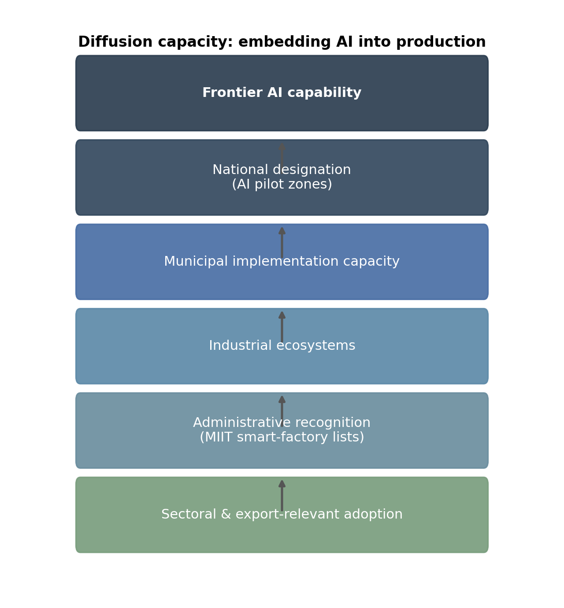
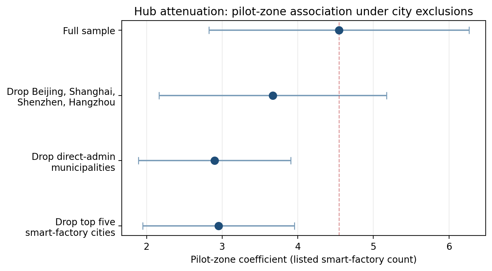
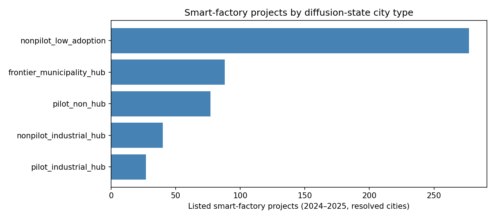
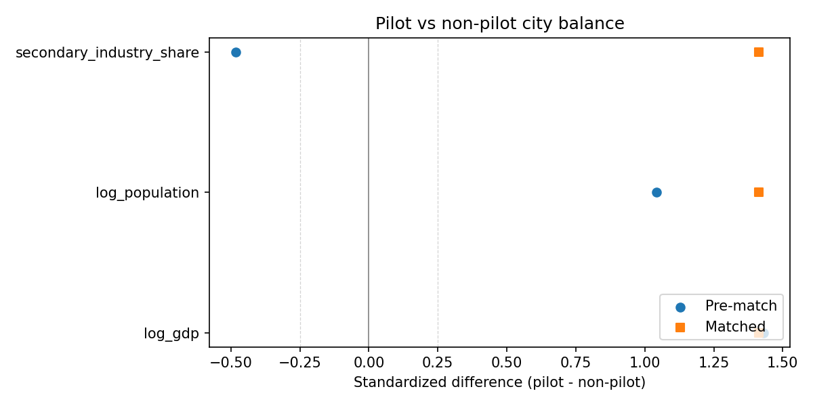

# The Diffusion State: AI Pilot Zones, Smart Factories, and the Hub Architecture of China’s Industrial AI Adoption

**Draft v1**  
**Status:** Passes 1–6 draft (abstract through conclusion). Grounded in `paper/main_tables/`, `paper/claim_table_map.csv`, `paper/results_memo.md`, `paper/red_team_memo.md`. Figures: `paper/figure_manifest.json`.  
**Core thesis:** China’s AI diffusion state is visible as a hub-centered industrial adoption architecture. Pilot-zone designation marks part of this architecture, but the evidence does not establish a uniform average treatment effect across treated cities.

## Abstract

**Frontier capability** asks who can build the most powerful AI—models, compute, labs, and private investment. **Diffusion capacity** asks who can embed AI into production. Those are different economic objects. This paper introduces a measurement architecture for China’s industrial **diffusion capacity** and documents how adoption appears in institutions, cities, sectors, and export-relevant manufacturing—not in frontier-model leaderboards alone.

The empirical setting links 17 National New Generation AI Innovation and Development Pilot Zone units with 509 Ministry of Industry and Information Technology excellence-level smart-factory projects (2024–2025 lists). Every project is assigned to a city under an evidence-classified procedure: 102 official-location exact rows, 357 rule-based text inferences, and 50 external-evidence verified rows, with a 70-row stratified audit (20/20 official confirmations; 20 confirmed and 30 insufficient-evidence rule-based rows). Listed recognition is concentrated in pilot-zone and high-capacity hub cities: 192 projects across 16 pilot-zone cities (mean 12.00 per city) versus 317 projects across 143 non-pilot cities (mean 2.22 per city).

The central pattern is **hub attenuation**, not a flat pilot-zone treatment. The baseline pilot-zone association is 4.55 (p < 0.001) but falls to 3.67 when Beijing, Shanghai, Shenzhen, and Hangzhou are excluded, to 2.90 when direct-admin municipalities are excluded, and to 2.95 when the top five smart-factory cities are excluded—remaining positive yet materially weaker. That supports a hub-centered **diffusion-state** interpretation: national designation operates through municipal implementation capacity and industrial ecosystems. The paper does not claim that pilot zones caused adoption or estimate an average treatment effect. Appendix robustness includes partial ChinaUTC public controls (51 cities; OLS count and log-count significant, Poisson not) and a frozen tiered patent-geography layer (~65% city fill) that is explicitly not exact publication-number geocoding. Strict EPS/NBS production controls remain blocked.

## 1. Introduction

The global debate over artificial intelligence is organized around **frontier capability**: which economy trains the strongest models, secures the most advanced chips, and attracts the largest private AI investment. That debate matters. It is also incomplete. AI becomes economically consequential when it **diffuses** into production systems—plants, logistics, quality control, scheduling, engineering workflows, and industrial coordination. The model frontier can advance quickly while the adoption frontier moves slowly. An economy can trail on headline model benchmarks yet still compete through the institutions that convert capability into recognized industrial practice.

This paper studies that second frontier in China. It is a **measurement and political-economy** study of how AI capability is converted into industrial adoption—not a patent-geography paper, a causal pilot-zone evaluation, a census of all smart factories, or a frontier-model competition account. The object of analysis is the **diffusion state**: the institutional architecture that moves a general-purpose technology from strategic priority into factories, sectors, and export-relevant supply chains.

China offers a disciplined empirical window because two public layers can be linked reproducibly. National **AI pilot zones** (17 designated city or county-level units, 2019–2021) mark places selected for AI development and application capacity—they are institutional markers, not randomly assigned treatments. **MIIT excellence-level smart-factory lists** (509 projects on the 2024 and 2025 registers) mark administrative recognition of advanced manufacturing adoption, not the full universe of Chinese smart factories. Linking the two layers reveals where adoption is visible in policy space: pilot-zone cities hold 192 listed projects across 16 cities (mean 12.00 per city) versus 317 projects across 143 non-pilot cities (mean 2.22 per city). The baseline city-year association is 4.55 (p < 0.001).

The paper’s interpretive contribution is that overlap alone is misleading without **hub architecture**. Excluding Beijing, Shanghai, Shenzhen, and Hangzhou lowers the coefficient to 3.67; excluding direct-admin municipalities to 2.90; excluding the top five smart-factory cities to 2.95. Associations stay positive but attenuate sharply—consistent with diffusion through municipal scale, administrative status, and industrial ecosystems rather than a uniform pilot shock. Sectoral ex ante exposure and export-relevant descriptives show where AI is complementary to production; they do not claim productivity or export causal effects.

### Contribution

This paper contributes an operational **measurement architecture for AI diffusion capacity**: reproducible linkage of pilot zones, smart-factory recognition, evidence-classified city resolution, hub-exclusion diagnostics, ex ante industry heterogeneity, and export-relevant sector tables—mapped to claim tiers and frozen engineering gates. Conceptually, it separates frontier capability from diffusion capacity and shows that China’s visible industrial AI adoption is **hub-centered**. Empirically, it documents concentration and attenuation patterns the design can support while blocking causal, productivity, and strict controlled claims the design cannot.

### Roadmap

Section 2 develops the diffusion-state concept and five-layer framework (national designation through sectoral compatibility). Section 3 describes institutional background. Section 4 presents data and measurement, including evidence classes and the stratified audit. Sections 5–8 present overlap, hub attenuation, sectoral selectivity, and export relevance. Section 9 reports appendix robustness—public ChinaUTC controls and tiered patent geography—without elevating blocked EPS/NBS or exact-geocoding claims. Sections 10–11 state limits and conclude on measuring diffusion capacity through cities, sectors, institutions, and standards—not frontier models alone.

## 2. Conceptual framework: the diffusion state

**Diffusion capacity** is the ability to embed general-purpose AI into production—not the ability to train the largest model. The **diffusion state** is the institutional architecture that performs that embedding: it links frontier capability to factories, sectors, and tradable industry through stacked policy and administrative layers. This paper measures one observable slice of that architecture in China; it does not reduce the diffusion state to patent counts, model benchmarks, or a single policy treatment.

The framework organizes adoption into **five layers**, each necessary but insufficient on its own (Figure 1):

1. **National designation** — strategic selection of places for AI development and application (here: 17 AI pilot-zone units, 2019–2021).
2. **Municipal implementation capacity** — local government scale, administrative status, and ability to run industrial programs.
3. **Industrial ecosystems** — depth of manufacturing clusters, engineering labor, parks, and automation complements.
4. **Administrative recognition** — public registers that certify exemplar adoption (here: MIIT excellence-level smart-factory lists, 509 projects in 2024–2025).
5. **Sectoral compatibility** — technological fit between AI tools and production processes (machine vision, predictive maintenance, digital twins, robotics, semiconductors, batteries, automotive, chemicals, pharmaceuticals, and related process industries).

Frontier capability enters at the top of the stack; export-relevant manufacturing sits at the bottom. Pilot zones mark layer 1; smart-factory lists mark layer 4. **Hub architecture** is how layers 2–3 concentrate adoption in a subset of cities—so overlap between layers 1 and 4 is expected but not interpretable as a uniform treatment effect.

### Why China

China combines a visible national AI program, city-level designation, and a recent administrative recognition register dense enough to link in a reproducible pipeline. That makes it a disciplined case for **measurement and political economy**: where adoption is visible in policy space, how it clusters, and what a hub-centered architecture implies for interpreting designation. The design generalizes as a template—designation, recognition, evidence-classified geography, hub diagnostics, sectoral exposure—even when other countries lack identical institutions.

### Contribution to policy debate

Industrial and technology policy often tracks frontier capability; this paper argues that **diffusion capacity** deserves parallel measurement: institutions, cities, sectors, procurement, parks, firms, and standards that convert models into production. For AI geopolitics, the relevant question is not only who leads on benchmarks but who can operationalize capability in manufacturing systems at scale.

### Related literature

The framework connects to general-purpose-technology implementation lags [@brynjolfsson2021productivity; @bloom2020diffusion], task-based automation in production [@acemoglu2014robots; @ifr2023worldrobotics], spatially concentrated Chinese industrial upgrading [@autor2013china], and frontier-centric AI rankings that understate adoption infrastructure [@masi2024aiindex]. The empirical contribution is **measurement architecture**, not closure of any causal literature.

## 3. Institutional background

National AI pilot zones designate cities and localities as environments for AI development and application. Designation is **not random**: authorities select units with prior research capacity, industrial depth, platform firms, or strategic relevance. Pilot zones are therefore **institutional markers** of the diffusion state’s first layer—not instruments for a clean average treatment effect.

MIIT excellence-level smart-factory lists identify projects that exemplify advanced smart-manufacturing adoption on public 2024 and 2025 registers. The lists measure **official recognition**, not the full stock of Chinese smart factories. That boundary is analytically productive: recognition is part of the diffusion system—standards, showcases, and links between firm-level adoption and industrial policy.

The paper asks whether layers 1 and 4 overlap in geography and whether that overlap is better read as a flat pilot shock or as **hub-mediated diffusion**. The evidence supports the second reading.

## 4. Data and measurement

The pipeline links pilot zones, smart-factory projects, evidence-classified city resolution, sectoral exposure, and export-relevant descriptives. Every claim maps to a reproducible artifact via `paper/claim_table_map.csv`.

### Claim-tier hierarchy

| Tier | Role in this paper |
|------|-------------------|
| Measured | Parsed pilot zones and smart-factory registers |
| Validated descriptive | Overlap, typology, export relevance, geo evidence classes |
| Baseline association | Pilot-zone coefficient in city-year models (uncontrolled) |
| Robust association | Hub exclusions; ex ante typology |
| Suggestive mechanism | Ex ante industry AI exposure |
| Partial public controls | Table I appendix only; not EPS-equivalent |
| Blocked | Strict EPS/NBS Table 5 (missing FDI, fixed-asset investment in public bundle) |
| Not supported | Causal ATE of pilot zones; productivity or export effects |

### Core counts

- **17** AI pilot-zone units (2019–2021) [@cset2020pilotzones; @xinhua2021seventeenzones].
- **509** MIIT excellence-level projects (235 from 2024 list, 274 from 2025) [@miit2024smartfactory; @miit2025smartfactory].
- **Outcome unit:** listed recognition, not total smart-factory activity.

### City-resolution evidence classes

All 509 projects receive a city assignment classified as:

| Class | Count | Role |
|-------|------:|------|
| Official-location exact | 102 | List or repost states project city |
| Rule-based text inference | 357 | Parsed from text when address incomplete |
| External-evidence verified | 50 | Confirmed via company site, annual report, government page, park, or registry |

A **70-row stratified audit** (20 official, 50 rule-based) finds 20/20 official confirmations, 20 confirmed rule-based rows, 30 insufficient-evidence rule-based rows, and no incorrect rows in the audit sample. Rule-based rows are reported with weaker status; the full register is not externally audited.

### Panels and limitations

The adoption panel covers **160 cities** and **320 city-years**; pre-2024 smart-factory counts are zero-filled because public excellence lists begin in 2024—event-time plots are **timing diagnostics only**, not pre-trend tests (Appendix Figure A2). Industry heterogeneity uses **ex ante** AI-exposure categories, not tags derived from project text, so the outcome does not define exposure. Export tables are **strategic relevance** descriptives, not export-effect estimates.

## 5. Descriptive overlap

The empirical puzzle is **concentration**: listed recognition is not spread evenly across China’s city system.

Among resolved cities, pilot-zone cities hold **192** projects across **16** cities (mean **12.00** per city). Non-pilot cities hold **317** projects across **143** cities (mean **2.22** per city)—a gap of **9.78** projects per city. Top cities illustrate hub concentration within the overlap: Shanghai (30, pilot), Chongqing (22, pilot), Beijing (19, pilot), Tianjin (17, pilot), Qingdao (14, non-pilot).

The baseline city-year association is **4.55** (p < 0.001; Table C). That coefficient is an association in the constructed adoption universe, not a causal effect of designation. It establishes that layers 1 and 4 align in policy space. It does not yet identify **how** that alignment is structured—flat pilot contrast or hub architecture.

## 6. Hub architecture and attenuation

**Hub attenuation** is the paper’s central empirical result (Figure 2; Table D). The question is how the pilot-zone coefficient moves when high-capacity cities are removed.

| Exclusion rule | Coefficient | Share of full sample |
|--------------|------------:|---------------------:|
| Full sample | 4.55 | 100% |
| Drop Beijing, Shanghai, Shenzhen, Hangzhou | 3.67 | 81% |
| Drop direct-admin municipalities | 2.90 | 64% |
| Drop top five smart-factory cities | 2.95 | 65% |

Coefficients stay positive and significant, but **attenuation is large**. A flat pilot-zone story predicts similar associations across treated cities; a pure mega-city story predicts collapse once hubs exit. The data sit between: pilot status matters descriptively, yet a substantial share of the baseline association runs through municipal scale, direct-administrative status, and industrial hubs.

Ex ante city typologies (Tables E, E ex ante; Figure 3) reinforce this: adoption clusters in frontier municipality hubs, pilot industrial hubs, and non-pilot industrial hubs—not in a simple pilot/non-pilot split. Typology labels use pre-existing attributes (pilot status, direct-admin status, mega-hub flags), not outcomes from the smart-factory counts themselves.

**Interpretation:** China’s visible industrial AI adoption is a **hub-and-spoke diffusion state**. National designation is meaningful because it operates where implementation capacity and ecosystems already exist.

## 7. Sectoral selectivity

Diffusion is **sectorally selective** because AI complements some production processes more than others. Ex ante industry exposure (Table F) tests whether listed projects concentrate in sectors with high technological compatibility—machine vision, quality inspection, predictive maintenance, digital twins, scheduling, robotics, logistics, semiconductors, batteries, automotive, machinery, chemicals, pharmaceuticals, and related process industries.

Preferred specifications use ex ante classifications; description-based tags are descriptive only. Results are **suggestive mechanism** evidence: they explain why hub cities host recognizable adoption but do not identify causal sectoral treatment effects. Diffusion capacity is industrial, not merely geographic.

## 8. Export relevance

Export tables (Tables G, H) ask whether recognized sectors overlap China’s **advanced manufacturing export basket**—strategic relevance, not export causation. Global demand, trade policy, exchange rates, and firm competitiveness also shape exports; this design does not isolate effects of MIIT recognition on export growth.

The descriptive finding still matters politically: if recognition clusters in electronics, batteries, machinery, automotive, steel, chemicals, pharmaceuticals, shipbuilding, and AI servers, the diffusion state connects to **tradable industrial capacity**. Industrial AI adoption is therefore a competitiveness question, not only a domestic modernization story.

## 9. Robustness and extensions

### 9.1 Hub exclusions and typology

Section 6 reports the main hub-attenuation and typology evidence. Province-year checks and balance diagnostics in the appendix remain **descriptive or controls-dependent**; they do not upgrade the causal tier.

### 9.2 Public ChinaUTC controls (appendix only)

Strict **EPS/NBS Table 5** models remain **blocked**—the public ChinaUTC bundle lacks FDI and fixed-asset investment required for the intended production-control design.

**Table I** reports a partial 2024 cross-section (51 complete cities) with GDP, population, secondary-industry structure, foreign trade, telecom, and industrial-output proxies [@chinautc2024]. Pilot-zone status stays positive in **OLS count** (+1.58, p = 0.020) and **OLS log-count** (+0.50, p = 0.018) specifications; **Poisson** (+0.23, p = 0.43) is not significant. Language must stay narrow: appendix robustness only—not EPS-equivalent, not a causal treatment effect, not a main-text controlled result.

### 9.3 Tiered patent Atlas (appendix only)

As a **robustness extension**, the repository links an industrial-AI patent corpus (4,014,104 OpenXLab IIDS keys) to a **tiered** applicant-geography layer frozen at **65.4%** city fill. Exact publication-number applicant-address geocoding is **not** available (`exact_geography_ready: false`; `ready_for_evidence_chain: false`). Locations follow a fixed priority stack: headquarters-page matches (~44% of keys), university locations (~12%), applicant-name city tokens (~9%), and an explicit unresolved stratum (~35%). **Publication-ready patent F1** and pilot-zone × patent causal claims remain blocked.

Appendix Tables P14 and P17 report coverage by confidence tier and audit summary (`paper/appendix_tables/`). Patent geography supports **robustness diagnostics only**—not main identification and not exact geocoding. Methods language follows `paper/tiered_patent_geography_methods_snippet.md`.

## 10. What the paper does not claim

The paper does **not** claim that:

- pilot zones **caused** smart-factory adoption or an average treatment effect across treated cities;
- AI diffusion **caused** productivity growth;
- MIIT recognition **caused** export upgrading;
- excellence-level lists are a **complete census** of Chinese smart factories;
- rule-based city assignment is **full external verification**;
- partial ChinaUTC controls **replace** blocked EPS/NBS specifications;
- tiered patent geography is **exact address geocoding** or evidence-chain-ready identification.

These limits define the contribution: a credible **measurement architecture** for diffusion capacity under transparent claim tiers.

## 11. Conclusion

Frontier capability and diffusion capacity are different economic objects. China’s industrial AI strategy is visible in the **overlap** between national pilot designation and MIIT smart-factory recognition, but the deeper pattern is **hub architecture**: associations attenuate when Beijing, Shanghai, Shenzhen, Hangzhou, direct-admin municipalities, and top adoption cities are excluded. Sectoral and export-relevant descriptives show where AI fits production; they do not substitute for causal designs the data cannot support.

The policy implication is to **measure diffusion capacity**—institutions, cities, sectors, procurement systems, industrial parks, firms, and standards—not frontier models alone. The next wave of AI’s economic impact may depend less on which economy trains the single best model and more on which economy embeds capability into the industrial base fastest. That is the diffusion state this paper makes measurable.

## Tables (paper/main_tables)

Embedded from reproducible CSVs. Claim tiers follow `paper/main_table_claim_map.csv`. Table I is appendix-only and not EPS-equivalent.

### Main text tables

### Table A

*Dataset counts and coverage (pilot zones, smart-factory projects, geo evidence classes).*

**Claim tier:** `measured` | **Claim ID:** `measurement_pilot_zones` | **Placement:** main

                                  dataset          unit  observations                years_covered                                         source
                              pilot_zones   city/county            17                    2019-2021                 data/processed/pilot_zones.csv
                    smart_factories_clean       project           509                   2024, 2025       data/processed/smart_factories_clean.csv
                  smart_factory_city_year     city-year           224 2024, 2025 (resolved cities)     data/processed/smart_factory_city_year.csv
              smart_factory_province_year province-year            59                   2024, 2025 data/processed/smart_factory_province_year.csv
             smart_factories_city_unknown       project             0                   2024, 2025          province-only location in MIIT tables
            smart_factories_city_resolved       project           509                   2024, 2025                 parser + audited geo overrides
 geo_resolution_rule_based_text_inference       project           357                   2024, 2025    data/processed/city_resolution_register.csv
   geo_resolution_official_location_exact       project           102                   2024, 2025    data/processed/city_resolution_register.csv
geo_resolution_external_evidence_verified       project            50                   2024, 2025    data/processed/city_resolution_register.csv

Source: `paper/main_tables/table_A_dataset_counts.csv` (9 rows in repository).

### Table B

*City-resolution evidence quality by resolution class and evidence type.*

**Claim tier:** `validated_descriptive` | **Claim ID:** `geo_resolution_quality` | **Placement:** main

          resolution_class  n_projects            evidence_type  share_projects  n_with_source_list_url_only  n_with_external_url
external_evidence_verified          50                     _all        0.098232                            0                   50
   official_location_exact         102                     _all        0.200393                          102                    0
 rule_based_text_inference         357                     _all        0.701375                          357                    0
external_evidence_verified          11    company_annual_report        0.021611                            0                   11
external_evidence_verified          23    company_site_registry        0.045187                            0                   23
external_evidence_verified           1     industrial_park_page        0.001965                            0                    1
external_evidence_verified          15         project_registry        0.029470                            0                   15
   official_location_exact         102      miit_location_field        0.200393                          102                    0
 rule_based_text_inference          28      embedded_html_table        0.055010                           28                    0
 rule_based_text_inference          64 firm_embedded_city_token        0.125737                           64                    0
 rule_based_text_inference          22       firm_parenthetical        0.043222                           22                    0
 rule_based_text_inference           1     firm_province_county        0.001965                            1                    0
 rule_based_text_inference         221      firm_registry_match        0.434185                          221                    0
 rule_based_text_inference          17  html_p_tag_rtl_location        0.033399                           17                    0
 rule_based_text_inference           4      project_branch_city        0.007859                            4                    0

Source: `paper/main_tables/table_B_city_resolution_quality.csv` (15 rows in repository).

### Table C

*Pilot-zone vs non-pilot overlap in listed smart-factory projects (resolved cities).*

**Claim tier:** `validated_descriptive` | **Claim ID:** `descriptive_pilot_overlap` | **Placement:** main

               sample  n_cities  total_projects_2024_2025  mean_projects_per_city  median_projects_per_city  mean_difference_pilot_minus_non
    pilot_zone_cities        16                       192               12.000000                      11.0                         9.783217
non_pilot_zone_cities       143                       317                2.216783                       1.0                         9.783217
  all_resolved_cities       159                       509                3.201258                       2.0                         9.783217

Source: `paper/main_tables/table_C_pilot_overlap.csv` (3 rows in repository).

### Table D

*Hub-exclusion robustness for pilot-zone association in city-year adoption models.*

**Claim tier:** `robust_association` | **Claim ID:** `hub_robustness` | **Placement:** main

                                   exclusion_rule     spec  n_cities  n_projects          model       term     coef  std_err      p_value                                       formula                                                              interpretation  coefficient_relative_to_full_sample  projects_remaining_share
                                      full_sample baseline       160         507 baseline_count pilot_zone 4.545660 0.877318 2.203282e-07 smart_factory_projects ~ pilot_zone + C(year)                                  baseline association (all resolved cities)                             1.000000                  1.000000
          drop_beijing_shanghai_shenzhen_hangzhou baseline       156         439 baseline_count pilot_zone 3.667832 0.768116 1.796138e-06 smart_factory_projects ~ pilot_zone + C(year)                           association weakens after dropping four mega-hubs                             0.806887                  0.865878
drop_beijing_shanghai_shenzhen_hangzhou_guangzhou baseline       155         431 baseline_count pilot_zone 3.731935 0.828425 6.641824e-06 smart_factory_projects ~ pilot_zone + C(year)                           association weakens after dropping five mega-hubs                             0.820988                  0.850099
                 drop_direct_admin_municipalities baseline       156         419 baseline_count pilot_zone 2.898601 0.514284 1.738514e-08 smart_factory_projects ~ pilot_zone + C(year) association weakens substantially when direct-admin municipalities excluded                             0.637663                  0.826430
                  drop_top_5_smart_factory_cities baseline       155         402 baseline_count pilot_zone 2.950704 0.511740 8.116544e-09 smart_factory_projects ~ pilot_zone + C(year)                       association weakens when top adoption cities excluded                             0.649126                  0.792899
                           drop_top_10_gdp_cities baseline       150         408 baseline_count pilot_zone 5.154349 1.293213 6.728357e-05 smart_factory_projects ~ pilot_zone + C(year)            association under top-GDP-city exclusion (requires GDP controls)                             1.133906                  0.804734

Source: `paper/main_tables/table_D_hub_exclusion.csv` (6 rows in repository).

### Table E

*City diffusion typology — project counts by type (outcome-informed labels; descriptive).*

**Claim tier:** `validated_descriptive` | **Claim ID:** `hub_architecture_typology` | **Placement:** main

*Note: Aggregated from city-level typology file.*

           diffusion_type  resolved_smart_factory_projects
    nonpilot_low_adoption                              277
frontier_municipality_hub                               88
            pilot_non_hub                               77
  nonpilot_industrial_hub                               40
     pilot_industrial_hub                               27

Source: `paper/main_tables/table_E_city_typology.csv` (160 rows in repository).

### Table E (ex ante)

*Ex ante city capacity typology — project counts by type (pre-outcome labels).*

**Claim tier:** `validated_descriptive` | **Claim ID:** `hub_architecture_typology_ex_ante` | **Placement:** main

*Note: City counts by ex ante typology (not project-weighted).*

       diffusion_type_ex_ante  n_cities
ex_ante_nonpilot_low_capacity       143
        ex_ante_pilot_non_hub        10
    frontier_municipality_hub         4
            ex_ante_pilot_hub         3

Source: `paper/main_tables/table_E_ex_ante_city_typology.csv` (160 rows in repository).

### Table F

*City-industry adoption models — key terms only (ex ante exposure interactions).*

**Claim tier:** `suggestive_mechanism` | **Claim ID:** `city_industry_exposure_ex_ante` | **Placement:** main

*Note: FE coefficients omitted; tag-derived spec is descriptive-only (not for main causal claims).*

                                         model                             term      coef  std_err      p_value  n_obs         exposure_source
        city_industry_pilot_x_exposure_ex_ante                        Intercept  0.831825 0.126274 4.474807e-11    385                 ex_ante
        city_industry_pilot_x_exposure_ex_ante                       pilot_zone -0.166057 0.098830 9.291295e-02    385                 ex_ante
        city_industry_pilot_x_exposure_ex_ante            high_exposure_ex_ante -0.062627 0.080093 4.342533e-01    385                 ex_ante
        city_industry_pilot_x_exposure_ex_ante pilot_zone:high_exposure_ex_ante  0.262465 0.078646 8.459407e-04    385                 ex_ante
           city_industry_pilot_x_score_ex_ante                        Intercept  0.780737 0.130601 2.258576e-09    385                 ex_ante
           city_industry_pilot_x_score_ex_ante                       pilot_zone -0.206648 0.109021 5.802915e-02    385                 ex_ante
           city_industry_pilot_x_score_ex_ante              ai_exposure_ex_ante  0.012957 0.040509 7.490779e-01    385                 ex_ante
           city_industry_pilot_x_score_ex_ante   pilot_zone:ai_exposure_ex_ante  0.158893 0.054376 3.476407e-03    385                 ex_ante
city_industry_pilot_x_exposure_tag_descriptive                        Intercept  0.831825 0.126274 4.474807e-11    385 descriptive_tag_derived
city_industry_pilot_x_exposure_tag_descriptive                       pilot_zone -0.166057 0.098830 9.291295e-02    385 descriptive_tag_derived
city_industry_pilot_x_exposure_tag_descriptive             high_exposure_sector -0.062627 0.080093 4.342533e-01    385 descriptive_tag_derived
city_industry_pilot_x_exposure_tag_descriptive  pilot_zone:high_exposure_sector  0.262465 0.078646 8.459407e-04    385 descriptive_tag_derived

Source: `paper/main_tables/table_F_ex_ante_industry_heterogeneity.csv` (903 rows in repository).

### Table G

*Export relevance of smart-factory sectors (descriptive).*

**Claim tier:** `validated_descriptive` | **Claim ID:** `export_relevance_descriptive` | **Placement:** main

                      sector_group  smart_factory_projects  share_of_smart_factory_projects  export_value_2024_x  share_of_china_exports_2024  export_value_2017  export_value_2024_y  log_export_growth_2017_2024  unit_value_index_2017  unit_value_index_2024  log_unit_value_growth_2017_2024       growth_method mapping_confidence                                                         note
ai_servers_and_computing_equipment                      48                         0.094303         1.249440e+12                     0.452604       8.805689e+11         1.249440e+12                     0.349883                    1.0               1.304993                         0.266198 log_level_2017_2024               high Descriptive strategic relevance; not a causal export effect.
                     autos_and_nev                      37                         0.072692         2.103545e+11                     0.076200       6.795596e+10         2.103545e+11                     1.129934                    1.0               3.095453                         1.129934 log_level_2017_2024               high Descriptive strategic relevance; not a causal export effect.
                         batteries                      14                         0.027505         7.618270e+10                     0.027597       1.145464e+10         7.618270e+10                     1.894739                    1.0               6.650814                         1.894739 log_level_2017_2024               high Descriptive strategic relevance; not a causal export effect.
              industrial_machinery                     247                         0.485265         6.380018e+11                     0.231113       4.534326e+11         6.380018e+11                     0.341494                    1.0               1.978209                         0.682192 log_level_2017_2024               high Descriptive strategic relevance; not a causal export effect.
                             other                      36                         0.070727                  NaN                          NaN                NaN                  NaN                          NaN                    NaN                    NaN                              NaN                 NaN                NaN Descriptive strategic relevance; not a causal export effect.
                    petrochemicals                      53                         0.104126         1.365680e+11                     0.049471       8.170165e+10         1.365680e+11                     0.513748                    1.0               1.671545                         0.513748 log_level_2017_2024             medium Descriptive strategic relevance; not a causal export effect.
                   pharmaceuticals                       6                         0.011788         1.702016e+10                     0.006165       7.106148e+09         1.702016e+10                     0.873438                    1.0               2.395131                         0.873438 log_level_2017_2024               high Descriptive strategic relevance; not a causal export effect.
    semiconductors_and_electronics                       4                         0.007859         2.246461e+11                     0.081377       1.000431e+11         2.246461e+11                     0.808925                    1.0               2.245494                         0.808925 log_level_2017_2024               high Descriptive strategic relevance; not a causal export effect.
                      shipbuilding                      19                         0.037328         3.383422e+10                     0.012256       1.997679e+10         3.383422e+10                     0.526902                    1.0               1.693677                         0.526902 log_level_2017_2024               high Descriptive strategic relevance; not a causal export effect.
                  steel_and_metals                      45                         0.088409         1.745123e+11                     0.063216       1.092010e+11         1.745123e+11                     0.468805                    1.0               1.598084                         0.468805 log_level_2017_2024               high Descriptive strategic relevance; not a causal export effect.

Source: `paper/main_tables/table_G_export_relevance.csv` (10 rows in repository).

### Table H

*Listed smart-factory sectors vs 2024 export basket shares (descriptive).*

**Claim tier:** `validated_descriptive` | **Claim ID:** `export_sector_share_comparison` | **Placement:** main

                      sector_group  smart_factory_projects  share_of_smart_factory_projects  share_of_china_exports_2024 mapping_confidence  log_export_growth_2017_2024  share_gap_sf_minus_export                                                                                         note
              industrial_machinery                     247                         0.485265                     0.231113               high                     0.341494                   0.254152 Descriptive comparison of listed smart-factory sector mix vs 2024 export basket; not causal.
                    petrochemicals                      53                         0.104126                     0.049471             medium                     0.513748                   0.054655 Descriptive comparison of listed smart-factory sector mix vs 2024 export basket; not causal.
                  steel_and_metals                      45                         0.088409                     0.063216               high                     0.468805                   0.025192 Descriptive comparison of listed smart-factory sector mix vs 2024 export basket; not causal.
                      shipbuilding                      19                         0.037328                     0.012256               high                     0.526902                   0.025072 Descriptive comparison of listed smart-factory sector mix vs 2024 export basket; not causal.
                   pharmaceuticals                       6                         0.011788                     0.006165               high                     0.873438                   0.005622 Descriptive comparison of listed smart-factory sector mix vs 2024 export basket; not causal.
                         batteries                      14                         0.027505                     0.027597               high                     1.894739                  -0.000092 Descriptive comparison of listed smart-factory sector mix vs 2024 export basket; not causal.
                     autos_and_nev                      37                         0.072692                     0.076200               high                     1.129934                  -0.003508 Descriptive comparison of listed smart-factory sector mix vs 2024 export basket; not causal.
    semiconductors_and_electronics                       4                         0.007859                     0.081377               high                     0.808925                  -0.073518 Descriptive comparison of listed smart-factory sector mix vs 2024 export basket; not causal.
ai_servers_and_computing_equipment                      48                         0.094303                     0.452604               high                     0.349883                  -0.358301 Descriptive comparison of listed smart-factory sector mix vs 2024 export basket; not causal.
                             other                      36                         0.070727                          NaN                NaN                          NaN                        NaN Descriptive comparison of listed smart-factory sector mix vs 2024 export basket; not causal.

Source: `paper/main_tables/table_H_export_sector_share_comparison.csv` (10 rows in repository).

### Appendix tables

### Table I

*Appendix: partial 2024 ChinaUTC public controls (not EPS-equivalent).*

**Claim tier:** `partial_public_controls_appendix_only` | **Claim ID:** `appendix_public_fallback_controls` | **Placement:** appendix

*Note: Pilot-zone rows only (appendix robustness).*

      term     coef  std_err   t_stat  p_value  n_obs  r_squared                                   model                                                                                                                                                   formula                        sample_rule  n_cities  years     fixed_effects                                                                                                   controls_included                         evidence_tier                                            paper_use                                                              control_source                                                      missing_controls
pilot_zone 1.579527 0.652781 2.419690 0.019835     51   0.523593     model_5b_public_fallback_count_2024 smart_factory_projects ~ pilot_zone + log_gdp + log_population + secondary_industry_share + foreign_trade_log1p + telecom_log1p + industrial_output_log1p chinautc_public_fallback_2024_only        52   2024 none; single year log_gdp + log_population + secondary_industry_share + foreign_trade_log1p + telecom_log1p + industrial_output_log1p partial_public_controls_appendix_only appendix robustness only; not EPS-equivalent Table 5 ChinaUTC public China City Statistical Yearbook fallback, units as reported FDI and fixed-asset investment unavailable in current public fallback
pilot_zone 0.504230 0.205183 2.457471 0.018100     51   0.513390 model_5c_public_fallback_log_count_2024         log1p_projects ~ pilot_zone + log_gdp + log_population + secondary_industry_share + foreign_trade_log1p + telecom_log1p + industrial_output_log1p chinautc_public_fallback_2024_only        52   2024 none; single year log_gdp + log_population + secondary_industry_share + foreign_trade_log1p + telecom_log1p + industrial_output_log1p partial_public_controls_appendix_only appendix robustness only; not EPS-equivalent Table 5 ChinaUTC public China City Statistical Yearbook fallback, units as reported FDI and fixed-asset investment unavailable in current public fallback
pilot_zone 0.233079 0.293775 0.793392 0.427549     51        NaN   model_5d_public_fallback_poisson_2024 smart_factory_projects ~ pilot_zone + log_gdp + log_population + secondary_industry_share + foreign_trade_log1p + telecom_log1p + industrial_output_log1p chinautc_public_fallback_2024_only        52   2024 none; single year log_gdp + log_population + secondary_industry_share + foreign_trade_log1p + telecom_log1p + industrial_output_log1p partial_public_controls_appendix_only appendix robustness only; not EPS-equivalent Table 5 ChinaUTC public China City Statistical Yearbook fallback, units as reported FDI and fixed-asset investment unavailable in current public fallback

Source: `paper/main_tables/table_I_appendix_public_fallback_controls.csv` (24 rows in repository).

## Figures

### Figure 1

*Conceptual architecture: from frontier AI capability to sectoral and export-relevant industrial adoption.*

Source: `outputs/figures/fig_diffusion_state_architecture.png`. Claim: `fig_diffusion_architecture`.

### Figure 2

*Pilot-zone coefficient on listed smart-factory counts under hub-exclusion rules (95% CI).*

Source: `outputs/figures/fig_hub_attenuation_pilot_coefficients.png`. Claim: `fig_hub_attenuation`.

### Figure 3

*Listed smart-factory projects by ex ante diffusion-state city type (2024–2025, resolved cities).*

Source: `outputs/figures/fig_city_typology_smart_factory_counts.png`. Claim: `fig_city_typology`.

---

# Appendix material

This appendix supports the main text in `paper/draft_v1.md`. It does not upgrade claim tiers in `paper/claim_table_map.csv`.

---

## Appendix A. City-resolution evidence and audit

### A.1 Evidence classes (full distribution)

All 509 MIIT excellence-level projects receive a city assignment classified as official-location exact (102), rule-based text inference (357), or external-evidence verified (50). See main Table B and `outputs/tables/table_16_geo_evidence_quality.csv`.

### A.2 Stratified audit (70 rows)

The audit samples 20 official-location rows and 50 rule-based rows. Results: 20/20 official confirmations; 20 confirmed rule-based; 30 insufficient-evidence rule-based; no incorrect rows in the audit sample. See `outputs/tables/table_17_geo_audit_error_rate.csv`. This does **not** constitute full external verification of all 509 assignments.

### A.3 External verification queue

Projects promoted to `external_evidence_verified` require non-list documentation (company site, annual report, government page, industrial park, registry). The external verification workflow is documented in `docs/GEO_WORKFLOW.md`.

---

## Appendix B. Hub-exclusion and typology (extended)

### B.1 Full hub-exclusion grid

Main text Table D reports the core exclusions. Extended specifications including Guangzhou and top-GDP-city drops appear in `outputs/tables/table_6_hub_exclusion_robustness.csv`. Top-GDP exclusions require valid GDP control sources and are labeled controls-dependent.

### B.2 Ex ante city typology

Figure 3 and Tables E / E ex ante classify cities by pilot status, direct-administrative status, and mega-hub flags **before** using smart-factory counts to define hub labels. See `outputs/tables/table_14_city_diffusion_typology.csv` and `table_18_city_diffusion_typology_ex_ante.csv`.

### B.3 Province-year descriptive check

Province-year models treat entire provinces as treated if they contain a pilot-zone city. This is a coarse overlap check only—not a causal province design. See `outputs/tables/table_19_province_year_models.csv`.

---

## Appendix C. Table I — partial public controls (not EPS-equivalent)

**Blocked:** strict EPS/NBS Table 5 (`table_5_controlled_adoption_models.csv`) because the public ChinaUTC bundle lacks FDI and fixed-asset investment.

**Table I** (`paper/main_tables/table_I_appendix_public_fallback_controls.csv`) uses a 2024 cross-section with 51 complete cities. Controls: GDP, population, secondary-industry structure, foreign trade, telecom, and industrial-output proxies [@chinautc2024].

| Specification | Pilot-zone coefficient | p-value |
|---------------|------------------------:|--------:|
| OLS count | +1.58 | 0.020 |
| OLS log-count | +0.50 | 0.018 |
| Poisson count | +0.23 | 0.43 |

Interpretation: appendix-only robustness. OLS specifications remain positive; Poisson is not significant. This is **not** evidence that EPS/NBS models pass and **not** a causal treatment effect.

---

## Appendix D. Tiered patent geography (robustness extension)

Industrial-AI patent records (4,014,104 OpenXLab IIDS keys) carry a **tiered** applicant-geography layer frozen at **65.4%** city fill. Engineering gates: `ready_for_tiered_robustness_patent_layer: true`; `ready_for_evidence_chain: false`; `exact_geography_ready: false`.

**Not claimed:** exact publication-number applicant-address geocoding; publication-ready pilot-zone × patent F1; causal patent diffusion effects.

### D.1 Tier priority stack

1. External publication-number matches (when present)  
2. Curated headquarters / university locations  
3. High-confidence applicant-name city tokens  
4. Explicit unresolved stratum  

### D.2 Coverage by tier (P14)

| Tier | Share of keys | City fill |
|------|-------------:|----------:|
| Official headquarters page | 43.9% | 100% |
| University location | 12.1% | 100% |
| Applicant name city token | 9.3% | 100% |
| Unresolved | 34.6% | 0% |

Source: `paper/appendix_tables/table_P14_tiered_geography_coverage_by_confidence.csv`.

### D.3 Audit summary (P17)

See `paper/appendix_tables/table_P17_tiered_robustness_audit.csv` and `table_P17_tiered_geography_tier_breakdown.csv`. Regenerate: `make atlas-iids-frozen-verify`.

Methods paragraph for journal paste: `paper/tiered_patent_geography_methods_snippet.md`.

---

## Appendix E. Timing and balance diagnostics

**Figure A2** plots pilot-zone coefficients by event time. Pre-2024 smart-factory counts are zero-filled because public excellence lists begin in 2024. This is a **timing diagnostic**, not pre-trend validation.

**Figure A1** reports standardized mean differences for pilot vs non-pilot cities (controls-dependent; appendix only).

---

## Appendix F. Reviewer defense and reproducibility

- Claim-to-table map: `paper/claim_table_map.csv`  
- Red-team memo: `paper/red_team_memo.md`  
- Reviewer snapshot: `paper/reviewer_results_snapshot.md`  
- Reproducibility: `paper/REPRODUCIBILITY.md`  
- One-command PCS rebuild: `make pcs`  
- Submission validation: `make validate-submission`

## Appendix figures

### Appendix figure 1

*Timing diagnostic: pilot-zone coefficients by event time (listed smart-factory counts; pre-2024 zeros). Not a pre-trend test.*

Source: `outputs/figures/fig_timing_diagnostic_pilot_zones.png`. Claim: `fig_timing_diagnostic`.

### Appendix figure 2

*Standardized mean differences for pilot vs non-pilot cities (appendix; controls-dependent).*

Source: `outputs/figures/fig_balance_standardized_differences.png`. Claim: `fig_balance`.

## References (BibTeX keys)

Use `paper/references.bib` with the keys below. Map draft claims via `paper/citation_map.csv`.

- **pilot_zone_policy**: `@cset2020pilotzones` — 17 national AI innovation and development pilot zones
- **pilot_zone_policy**: `@xinhua2021seventeenzones` — Full list validation
- **smart_factory_lists**: `@miit2024smartfactory` — 2024 excellence batch (N=235)
- **smart_factory_lists**: `@miit2025smartfactory` — 2025 excellence batch (N=274)
- **appendix_controls**: `@chinautc2024` — Table I public fallback; not EPS-equivalent
- **export_descriptives**: `@cepii2024baci` — BACI HS17 sector shares
- **global_ai_context**: `@masi2024aiindex` — AI Index capability vs adoption framing
- **robot_compatibility**: `@ifr2023worldrobotics` — Industrial robotics and automation intensity
- **diffusion_economics**: `@bloom2020diffusion` — Innovation diffusion measurement
- **diffusion_economics**: `@brynjolfsson2021productivity` — GPT diffusion and productivity J-curve
- **automation_labor**: `@acemoglu2014robots` — Automation complementarities
- **china_industrial_context**: `@autor2013china` — China shock and sectoral structure
- **growth_framing**: `@jones2021ai` — Capability vs diffusion in growth
- **industrial_policy**: `@miit2024aiplus` — AI+ manufacturing policy context

## Submission package (engineering)

- Regenerate: `make paper-draft-export`
- Gates: `make validate-submission`
- BibTeX: `paper/references.bib`
